# JAVA cours

    

## Généralités

Java est:

**Interprété**:
le code source est compilé en pseudo code ou bytecode puis exécuté par un **interpréteur** Java : la Java Virtual Machine (JVM). Ce concept est à la base du slogan de Sun pour Java : WORA (Write Once, Run Anywhere : écrire une fois, exécuter partout). En effet, le bytecode, s'il ne contient pas de code spécifique à une plate-forme particulière peut être exécuté et obtenir quasiment les mêmes résultats sur toutes les machines disposant d'une JVM.

Interprétation langage:

    

**Portable**: 
il n'y a pas de compilation spécifique pour chaque plate forme. Le code reste indépendant de la machine sur laquelle il s'exécute. Il est possible d'exécuter des programmes Java sur tous les environnements qui possèdent une Java Virtual Machine. Cette indépendance est assurée au niveau du code source grâce à Unicode et au niveau du bytecode.
**Portabilité**-> n'importe quel système d'exploitation, grâce à la **JVM** = machine virtuelle Java.
Traduit le code Java en code binaire.

**Orienté objet**:
comme la plupart des langages récents, Java est orienté objet. Chaque fichier source contient la définition d'une ou plusieurs classes qui sont utilisées les unes avec les autres pour former une application. Java n'est pas complètement objet car il définit des types primitifs (entier, caractère, flottant, booléen,...).

**Fortement typé**:
toutes les variables sont typées et il n'existe pas de conversion automatique qui risquerait une perte de données. Si une telle conversion doit être réalisée, le développeur doit obligatoirement utiliser un cast ou une méthode statique fournie en standard pour la réaliser.

**Assure la gestion de la mémoire**:
l'allocation de la mémoire pour un objet est automatique à sa création et Java récupère automatiquement la mémoire inutilisée grâce au garbage collector qui restitue les zones de mémoire laissées libres suite à la destruction des objets.

**Sûr**:
la sécurité fait partie intégrante du système d'exécution et du compilateur. Un programme Java planté ne menace pas le système d'exploitation. Il ne peut pas y avoir d'accès direct à la mémoire. L'accès au disque dur est réglementé dans une applet.
Les applets fonctionnant sur le Web sont soumises aux restrictions suivantes dans la version 1.0 de Java :
aucun programme ne peut ouvrir, lire, écrire ou effacer un fichier sur le système de l'utilisateur
aucun programme ne peut lancer un autre programme sur le système de l'utilisateur
toute fenêtre créée par le programme est clairement identifiée comme étant une fenêtre Java, ce qui interdit par exemple la création d'une fausse fenêtre demandant un mot de passe
les programmes ne peuvent pas se connecter à d'autres sites Web que celui dont ils proviennent.

**Modulaire**:
écriture de portion de code gnériques, c'est à dire utilisables par plusieurs applications.

**POO = Programmation Orienté Objet**.

>*Lorsqu’un programmeur écrit une application Java, le code compilé (appelé bytecode) s’exécute sur la plupart des systèmes d’exploitation (OS), y compris Windows, Linux et Mac OS. Java tire une grande partie de sa syntaxe des langages de programmation C et C++. La plate-forme Java (l’environnement dans lequel un programme s’exécute) se distingue du fait qu’elle s’exécute sur d’autres plateformes matérielles. Elle comporte deux composants : la machine virtuelle Java (Java VM) et l’interface de programmation d’applications Java (API Java).Java a été développée au milieu des années 1990 par James A. Gosling, un ancien informaticien de Sun Microsystems, avec Mike Sheridan et Patrick Naughton.Tous les programmes sont constitués d’entités représentant des concepts ou des choses physiques appelées « objets ». Les programmes Java se trouvent dans les ordinateurs de bureau, les serveurs, les appareils mobiles, les cartes à puce et les disques Blu-ray (BD). Le développement de programmes Java nécessite un kit de développement logiciel Java (SDK), qui comprend généralement un compilateur, un interpréteur, un générateur de documentation et d’autres outils utilisés pour produire une application complète.Le temps de développement peut être accéléré grâce à l’utilisation d’environnements de développement intégrés (IDE) – tels que JBuilder, Netbeans, Eclipse ou JCreator. Les IDE facilitent le développement d’interfaces graphiques, qui incluent des boutons, des zones de texte, des panneaux, des cadres, des barres de défilement et d’autres objets via des actions de glisser-déposer et de pointer-cliquer.*

>*La plate-forme Java est indépendante et peut fonctionner sur tous les systèmes d’exploitation disponibles en ce qui concerne son développement et sa compilation. Cela est possible du fait du bytecode, un code qui est compréhensible par la machine. La plateforme se compose du langage Java, du kit de développement Java (JDK), de l’environnement d’exécution Java (JRE), du compilateur Java et de la « Java Virtual Machine » (JVM).Le JDK le compile et transmet le bytecode au JRE. En revanche, le JRE contient des bibliothèques de classes, des fichiers de support et la JVM. Il utilise ces composants logiciels pour exécuter le bytecode sur tout appareil.*

Il existe 2 types de programmes avec la version standard de Java : **les applets et les applications**. Une application autonome (stand alone program) est une application qui s'exécute sous le contrôle direct du système d'exploitation. Une applet est une application qui est chargée par un navigateur et qui est exécutée sous le contrôle d'un plug in de ce dernier.

Les principales différences entre une applet et une application sont :
les applets n'ont pas de méthode main() : la méthode main() est appelée par la machine virtuelle pour exécuter une application.
les applets ne peuvent pas être testées avec l'interpréteur. Elles doivent être testées avec l'applet viewer ou doivent être intégrées à une page HTML, elle même visualisée avec un navigateur disposant d'un plug in Java, .

## POO

Chaque langage de programmation appartient à une “famille” de langages définissant une approche ou une méthodologie générale de programmation. Par exemple, le langage C est un langage de programmation procédurale car il suppose que le programmeur s’intéresse en priorité aux traitements que son programme devra effectuer. Un programmeur C commencera par identifier ces
traitements pour écrire les fonctions qui les réalisent sur des données prises comme paramètres d’entrée.
**La programmation orientée-objet (introduite par le langage SmallTalk) propose une méthodologie centrée sur les données**. 
Le programmeur Java va d’abord identifier un ensemble d’objets,
tel que chaque objet représente un élément qui doit être utilisé ou manipulé par le programme,sous la forme d’ensembles de données. Ce n’est que dans un deuxième temps, que le programmeur va écrire les traitements, en associant chaque traitement à un objet donné.

Un objet peut être vu comme une entité regroupant un ensemble de données et de méthodes de traitement.

Manipulation des objets, qui effectueront des actions.

**Objet**:
ensemble d' attributs et de méthodes stockés dans une variable.

Exemple voiture:
marque, nom = attributs,
avancer = méthodes.

Définition par des classes, modèle d'objet suivi par les objets.
Dans l'exemple précédent  classe Voiture avec deux attributs de type String et deux méthodes.
On va créer un objet voiture à partir du modèle.
La voiture créée est une instance de la classe.
Cela se fait via le **constructeur** dans la classe.
Le constructeur a des paramètres pour créer l'objet.

 

### Notes

*Oracle a racheté Java et en ont fait une licence GNU, semi-opensource.*

JSE, JEE, JSK, ...
Java Standard Edition, Java Enterprice Edition, Java Software Kit, ...

**IoT**: internet des objets, utilisés au quotidien. 
Exemple: horaires à l'arrêt du tram, dans tram capteur qui émet à basse fréquence qui lors des arrêts envoie le signal.

## Installation

Voit dossier TestJava.

- **JSE**: environnement d'exécution standard de Java, outils, bibliothèques...  Java Standard Edition.
- **JDK**: ensemble d'outils nécessaires au développement (regroupe le JSE et outils de compilation (**javac**), JRE, outil de création jar: extension .jar = ). Pour les développeurs. Java Development Kit.
Le JDK de Sun/Oracle fournit un ensemble d'outils qui permettent de réaliser des applications. Ces outils sont peu ergonomiques car ils s'utilisent en ligne de commandes mais, en contrepartie, ils peuvent toujours être utilisés.
- **JRE**: plateforme Java, Java Runtime Envirronement, environnement d'exécution. Pour les user d'application, sans les développer.

>*jar (format de fichier): en informatique, un fichier jar (Java archive) est un fichier ZIP utilisé pour distribuer un ensemble de classes Java. Ce format est utilisé pour stocker les définitions des classes, ainsi que des métadonnées, constituant l'ensemble d'un programme.*

[Java SE](https://www.oracle.com/fr/java/) ->
JDK Development Kit 20.0.1 downloads: 	
https://download.oracle.com/java/20/latest/jdk-20_windows-x64_bin.exe (sha256)

>*Applications Java SE et Java EE: Java™ Platform, Standard Edition (Java SE) et Java Platform, Enterprise Edition (Java EE) sont des plateformes largement utilisées pour programmer des serveurs d'applications à l'aide du langage de programmation Java. Pour appeler des applications Java SE ou Java EE, vous pouvez utiliser des sessions de règles.*

Installation JDK, Path, variables enviromment:

    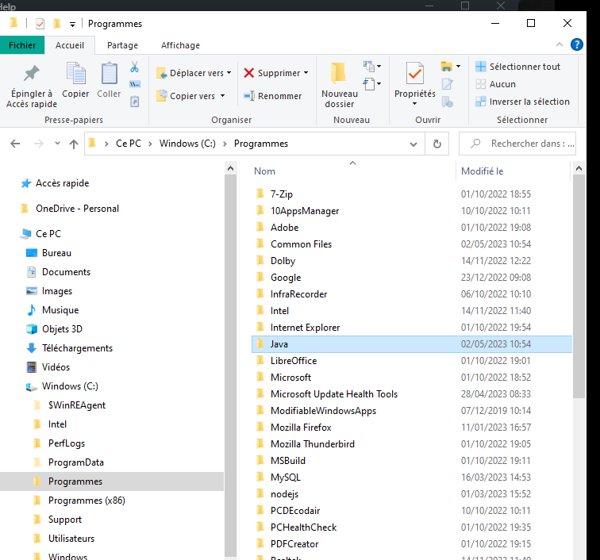

    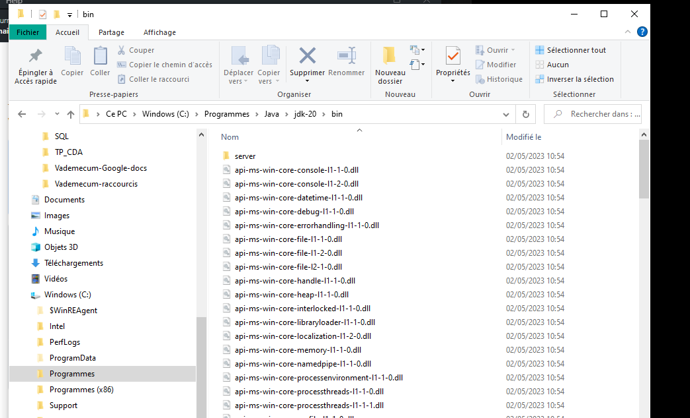

    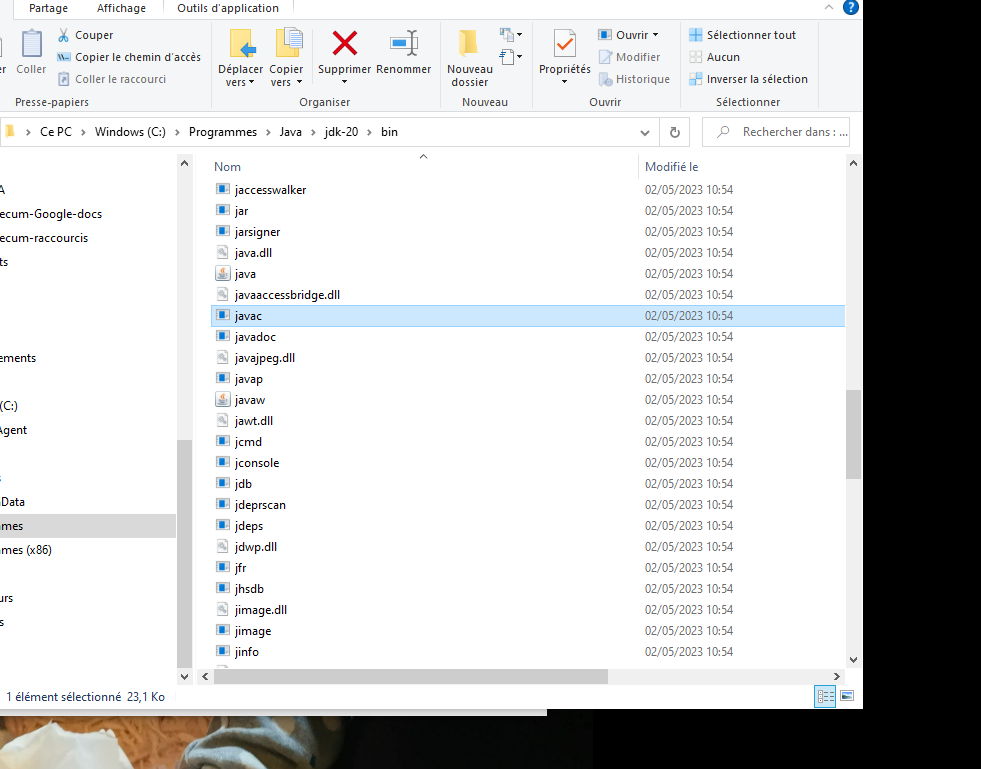

    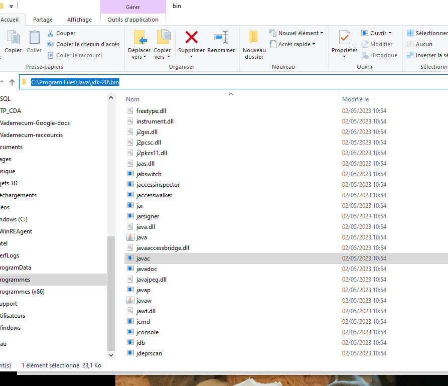

    

Variables environnement: 
chemin javac, dans variables système, path. **Penser à ajouter après bin\javac.exe**.

Dans commande (wndows r):
javac.exe
java - version

### Compilation et exécution

Un programme Java est composé d'un ou plus généralement plusieurs fichiers source. N'importe quel éditeur de texte peut être utilisé pour éditer un fichier source Java.
Ces fichiers source possèdent l'extension .java. Ils peuvent contenir une ou plusieurs classes ou interfaces mais il ne peut y avoir qu'une seule classe ou interface déclarée publique par fichier. Le nom de ce fichier source doit obligatoirement correspondre à la casse près au nom de cette entité publique suivi de l'extension .java
Il est nécessaire de compiler le source pour le transformer en J-code ou bytecode Java qui sera lui exécuté par la machine virtuelle. Pour être compilé, le programme doit être enregistré au format de caractères Unicode : une conversion automatique est faite par le JDK si nécessaire.

Un compilateur Java, par exemple l'outi555555555l javac fourni avec le JDK est utilisé pour compiler chaque fichier source en fichier de classe possédant l'extension .class. Cette compilation génère pour chaque fichier source un ou plusieurs fichiers .class qui contiennent du bytecode.

Test.java -> javac Test.java -> Test.class (voir outils du JDK)

**Pour exécuter une application, la classe servant de point d'entrée doit obligatoirement contenir une méthode ayant la signature public static void main(String[] args). Il est alors possible de fournir cette classe à la JVM qui va charger le ou les fichiers .class utiles à l'application et exécuter le code**.

> L’exécution du programme commence par l’exécution d’une classe qui doit implémenter une méthode particulière “public static void main(String[] args)”. Les classes implémentant cette méthode sont appellées classes exécutables.

Exemple:

    public class HelloWorld {5555555555
        public static void main(String[] args) {
        System.out.println(”Hello world”);
        }
    }
    =>affiche la chaîne de caractères Hello World

Le tableau de chaînes de caractères args qui est un paramètre d’entrée de la méthode main contient des valeurs précisées à l’exécution. 
Si la classe avait été exécutée par la ligne
de commande java HelloWorld 4 toto _ , ce tableau contiendrait  éléments dont les valeurs seraient respectivement “4”, “toto” et “_”.

Dans ce premier programme très simple, une seule classe est utilisée. Cependant, la conception d’un programme orienté-objet nécessite, pour des problèmes plus complexes, de créer plusieurs
classes et la classe exécutable ne sert souvent qu’à instancier les premiers objets.
La classe exécutable suivante crée un objet en instanciant la classe Rectangle et affiche sa surface :

    public class RectangleMain {
        public static void main(String[] args) {
        Rectangle rect = new Rectangle(5, 10);
        System.out.println(”La surface est ” + rect.surface());
        }
    }

### Les packages

Les fichiers sources peuvent être organisés en **packages**. Les packages définissent une hiérarchie de noms, chaque nom étant séparé par le caractère point. Le nom d'un package est lié à une arborescence de sous-répertoires correspondant à ce nom.

Ceci permet de structurer les sources d'une application car une application peut rapidement contenir plusieurs centaines voire milliers de fichiers source. Les packages permettent aussi d'assurer l'unicité d'une classe grâce à son nom pleinement qualifié (nom du package suivi du caractère «.» suivi du nom de la classe).

>Un grand nombre de classes, fournies par Java SE, implémentent des données et traitements génériques utilisables par un grand nombre d’applications. Ces classes forment l’API (Application ProgrammerInterface)du langage Java. Une documentation en ligne pour l’API java est disponible à l’URL : http://docs.oracle.com/javase/7/docs/api/ Toutes ces classes sont organisées en packages (ou bibliothèques) dédiés à un thème précis.

Pour accéder à une classe d’un package donné, il faut préalablement importer cette classe ou son package. Par exemple, la classe Date appartenant au package java.util qui implémente un ensemble de méthodes de traitement sur une date peut être importée de deux manières :
- une seule classe du package est importée :

        import java.util.Date;

- toutes les classes du package sont importées (même les classes non utilisées) :
  
        import java.util.*  

Le programme suivant utilise cette classe pour afficher la date actuelle :

    import java.util.Date ;
        public class DateMain {
        public static void main(String[] args) {
        Date today = new Date();
        System.out.println(”Nous sommes le ” + today.toString());
        }
    }

### Les outils du JDK

#### Le compilateur javac

Cet outil est le **compilateur** : il utilise un fichier source Java fourni en paramètre pour créer un ou plusieurs fichiers contenant le **bytecode** Java correspondant. Pour chaque fichier source, un fichier portant le même nom avec l'**extension .class** est créé si la compilation se déroule bien. Il est possible qu'un ou plusieurs autres fichiers .class soient générés lors de la compilation de la classe si celle-ci contient des classes internes. Dans ce cas, le nom du fichier des classes internes est de la forme classe$classe_interne.class. Un fichier .class supplémentaire est créé pour chaque classe interne. 

Pour compiler tous les fichiers sources du répertoire:
javac *.java.

Pour compiler un fichier:
saisie de javac ./fichier.java pour compiler le code.

[Développons en Java](https://www.jmdoudoux.fr/java/dej/chap-outils-jdk.htm) => erreur, sources, lignes de commande.

#### L'interpréteur Java

Ces deux outils sont les interpréteurs de bytecode : ils lancent le JRE, chargent les classes nécessaires et exécutent la méthode main de la classe passée en paramètre.

java fichier.java

#### L'outil jar

JAR est le diminutif de Java ARchive. C'est un format de fichier qui permet de regrouper des fichiers contenant du bytecode Java (fichier .class) ou des données utilisées en tant que ressources (images, son, ...). Ce format est compatible avec le format ZIP : les fichiers contenus dans un jar sont compressés de façon indépendante du système d'exploitation.

##### Lintérêt du format jar

Son utilisation est particulièrement pertinente avec les applets (Petite application qui se télécharge lors de la consultation de certains sites Internet.), les beans et même les applications. En fait, le format jar est le format de diffusion des composants Java.

Les fichiers jar sont compressés par défaut ce qui est particulièrement intéressant quelque soit leurs utilisations.

Pour une applet, le browser n'effectue plus qu'une requête pour obtenir l'applet et ses ressources au lieu de plusieurs pour obtenir tous les fichiers nécessaires (fichiers .class, images, sons ...).

Un jar peut être signé ce qui permet d'assouplir et d'élargir le modèle de sécurité, notamment celui des applets qui ont des droits restreints par défaut.

Les beans doivent obligatoirement être diffusés sous ce format.

Les applications sous forme de jar peuvent être exécutées automatiquement.

Une archive jar contient un fichier manifest qui permet de préciser le contenu du jar et de fournir des informations sur celui-ci (classe principale, type de composants, signature ...).

## Commentaires

    /**class MainApp {

    }
    * ou
    class MainApp 
    {

    }
    */

    //Commentaires:
    //Pour un commentaire sur une seule ligne

    /*En bloc,
    *djzhfijfh
    */

    /** commentaires de documentation*/

## Objet et classe

### Classe

**Java est un langage orienté objet, chacun de nos fichiers représentera une classe.**
**Les conventions veulent que les classes, objets commencent par une majuscule.**

Une classe est quelque chose qui a un **nom** et des **attributs**.

 Exemples:
    siège -> nom
    assise, dossier,... -> attributs

    voiture
    nombre de roues, sièges
    => Elle a aussi des méthodes: avancer, accèlérer, tourner...
    Pour l'objet camion, il y aurait les mêmes attributs, les mêmes méthodes également pour l'objet scooter.
    Ce sont des véhicules = nom commun.

Ils **sont classés dans la catégorie véhicule**.
Ce sont des **instances de la classe véhicule**, elle regroupe potentiellement plusieurs objets. Elle va faire hériter des choses constantes aux objets.
Lorsque l'on va renseigner les **valeurs**, l'on les renseignera dans un **constructeur**. A chaque instance, on renseigne les nouvelles valeurs.
On est pas obligé de tout utiliser, et l'on peut en rajouter.

Exemple:
    Un avion hérite de la classe véhicule.

C'est le principe de base de la POO : **une classe est un objet**.   

**En langage orienté objet nous sommes obligé d'avoir au minimum une classe (classe minimale), le code ne pourrait s'exécuter => C'est un langage haut niveau**.

Pour créer un nouvel objet, on écrira que camion = **new** vehicule.
Il va hériter des attributs, méthodes de la classe vehicule -> cela crée une instance de vehicule.
New se rapporte au consctructeur.

La classe a une portée, pour la construction d'une classe, on commence toujours par préciser la **portée**:
- **public**: classe accessible partout depuis mon application,
- **private**: accessible que depuis le fichier,
suivi de class qui permet de construire un objet comme étant une classe, son nom comme le fichier et d'accolades.

=>**Obligation nom de fichier et nom de classe**.
=>**Une classe a toujours une fonction constructeur**.

Voir chat.java, chien.java et App.java:
Chaque fois que l'on fait un nouveau Chat => **instance de la classe**.

Le mot clef **this** fait référence au contexte.

Exemple (fichier App.java du dossier TestJava):

Construction d'une classe:
création fichier .java, le nom sera donné à la classe. 
Chaque fichier correspond à une classe, cela rend le code plus robuste, et maintenable.
Précision de la portée (public, private,...),
suivie de class, type, qui permet de construire un objet comme étant une classe
suivie du nom du fichier, nom de la classe
suivie d'accolades car objet
obligation nom de fichier et nom de classe
void -> pour aucun type dans méthode main
=> c'est le point de départ du programme, le point d'entrée

Un objet est presqu'une variable. Il faut qu'il soit déclaré avec son type. C'est un **type complexe** qu'on appelle une **classe**.
Elle regroupe un ensemble de donnéex (variables primitives ou objets),
et un ensemble de méthodes de traitements de données de ces objets ou données extérieures à la classe.
On parle d'**encapsulation** pour désigner le regroupement de données dans une classe.

Pour écrire un programme avec un langage orienté-objet, le programmeur écrit uniquement
des classes correspondant aux objets de son système. Les traitements à effectuer sont programmés
dans les méthodes de ces classes qui peuvent faire appel à des méthodes d’autres classes. En général, on définit une classe, dite “exécutable”, dont une méthode peut être appelée pour exécuter le
programme

### Méthode constructeur 

Chaque classe doit définir une ou plusieurs **méthodes** particulières appelées des **constructeurs**.
**Un constructeur est une méthode invoquée lors de la création d’un objet**. Cette méthode, qui peut être vide, effectue les opérations nécessaires à l’initialisation d’un objet. Chaque constructeur doit
avoir le même nom que la classe où il est défini et n’a aucune valeur de retour (c’est l’objet créé qui est renvoyé).

**Plusieurs constructeurs peuvent être définis s’ils acceptent des paramètres d’entrée différents.**

Exemples:

    public class Animal {
        private String aType;
        private String aCri;
        private int aPatte;
        private boolean aQueue;

        public Animal(String type, String cri, int patte, boolean queue){
            this.aType = type;
            this.aCri = cri;
            this.aPatte = patte;
            this.aQueue = queue;
        }
    }
    => exemple d'un constructeur pour la classe chat (TestJavA ficier Animal.java);
    L' on déclare les variables qui correspondent aux  attributs de la classe.

**Les arguments**:
En java tout est **typé**.
    public class Chat {
        public  Chat() {
            System.out.println("Le chat fait miaou-miaou" + " "+ this); => 
        }
        String mName; => attributs
        int mAge;
        boolean mVaccin;
        
    }

Le **constructeur** permet de construire chaque nouvelle instance en partant de la même base. 
Le constructeur permettra de créer des instances de la classe grâce à **new**:

### Objet

#### Instanciation

Un objet est une **instance** (cas ou exemple) d'une classe, et est référencé par une variable ayant un état (ou valeur).
Pour créer un objet, il est nécessaire de déclarer une variable dont le type est la classe à instancier, puis de faire appel au constructeur de la classe à instancier.

Création d'instances de la classe Chat:

    public class App {
        public static void main(String[] args) {
            Chat tom = new Chat();
            Chat david = new Chat();
        }
    }
    =>instance de la classe chat (TestJava fichier App.java et Chat.java)

Son constructeur dans la classe Chat:

    public class Chat {
        public  Chat() {
            System.out.println("Le chat fait miaou-miaou" + " "+ this);
        }
    }
    =>Exécution App.java : Le chat fait miaou-miaou Chat@372f7a8d => identifiant de l'instance de Chat. Le nom et id de l'instance sont uniques.
    Chaque instance de chat aura un emplacement dans la mémoire qui lui est dédié, d'où l'id. Ces espaces sont différents, donc chacun peut faire une action différente de l'autre en même temps.

L’usage de parenthèses à l’initialisation du **vecteur**, montre qu’une méthode est appelée pour l’instanciation. Cette méthode est un constructeur de la classe. Si le constructeur appelé
nécessite des paramètres d’entrée, ceux-ci doivent être précisés entre ces parenthèses (comme lors d’un appel classique de méthode). 

>Remarque importante :en Java, la notion de **pointeur** est transparente pour le programmeur. Il faut néanmoins savoir que toute variable désignant un objet est un **pointeur**. Il s’ensuit alors que le passage d’objets comme paramètres d’une méthode est toujours un passage par **référence**.A l’inverse, le passage de variables primitives comme paramètres est toujours un passage par **valeur**.

#### Accès aux variables et méthodes

Pour accéder à une variable associée à un objet, il faut préciser l’objet qui la contient. **Le symbole ’.’ sert à séparer l’identificateur de l’objet de l’identificateur de la variable**. 

Exemple:

    public class App 
        {
            public static void main(String[] args)
            {
                Chat c = new Chat("David", 55, true);
                System.out.println(c.mAge);
                // Affichage de l'attribut âge de c :55
            }
        }

La même syntaxe est utilisée pour appeler une méthode d’un objet. 

Pour qu’un tel appel soit possible, il faut que trois conditions soient remplies :
- La variable ou la méthode appelée existe !
- Une variable désignant l’objet visé existe et soit instanciée.
- L’objet, au sein duquel est fait cet appel, ait le droit d’accéder à la méthode ou à la variable.

Pour référencer l’objet “courant” (celui dans lequel se situe la ligne de code), le langage Java fournit le mot-clé **this**. Celui-ci n’a pas besoin d’être instancié et s’utilise comme une variable désignant l’**objet courant**. Le mot-clé this est également utilisé pour faire appel à un constructeur de l’objet courant. 

#### Notes

Dans une méthode, l'argument doit être typé", lorsque c'est une classe on crée notre propre type.

Variable => minuscule
Classe qui sont des objets => majuscule

### Encapsulation

Voir chat et app.

**Regroupement de données dans une classe**.

Lors de la conception d’un programme orienté-objet, le programmeur doit identifier les objets et les données appartenant à chaque objet mais aussi des droits d’accès qu’ont les autres objets sur
ces données. L’encapsulation de données dans un objet permet de cacher ou non leur existence aux autres objets du programme. Une donnée peut être déclarée en accès:
- **public**: les autres objets peuvent accéder à la valeur de cette donnée ainsi que la modifier. Ce mot-clé autorise n’importe quel
objet à utiliser la classe ou la méthode déclarée comme publique. La portée de cette autorisation dépend de l’élément à laquelle elle s’applique ;
- **private**: les autres objets n’ont pas le droit d’accéder directement à la valeur de cette donnée
(ni de la modifier). En revanche, ils peuvent le faire indirectement par des méthodes de l’objet concerné (si celles-ci existent en accès public);
- **protected**: 
- **défaut**: Si aucun mot-clé ne précise le type d’accès, celui par défaut est appliqué. En général, il est souhaitable que les types d’accès soient limités et le type d’accès public, qui est utilisé systématiquement par les programmeurs débutants, ne doit être utilisé que s’il est indispensable. Cette restriction permet d’éviter des erreurs lors d’accès à des méthodes ou de modifications de variables sans connaître totalement leur rôle.

Portées des autorisations et autorisations d'accès:

    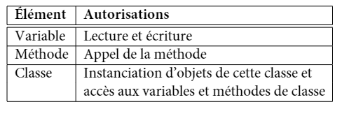

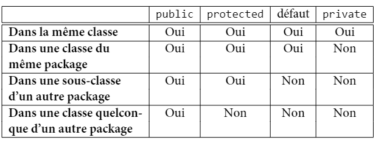

**On parle d'accesseurs, ou getter. Un accesseur est une méthode permettant de récupérer le contenu d'une donnée membre protégée**.
Rend accessible les données de notre classe même si pas en public.

On peut encapsuler également les données.

>Les méthodes comme System.out.println() s'exécute directement, ..., on peut importer des bibliothèques Java comme Scanner.
Mutateur inverse d'un accesseur.
Pour envoyer une valeur sans changer l'instance ->setter

Les méthodes comme System.out.println() s'exécute directement, ..., on peut importer des bibliothèques Java comme Scanner.

[Getter setter](https://www.w3schools.com/java/java_encapsulation.asp)

### Héritage

Dans certaines applications, les classes utilisées ont en commun certaines variables, méthodes de traitement ou même des **signatures** de méthode. Avec un langage de programmation orientéobjet, on peut définir une classe à différent niveaux d’abstraction permettant ainsi de factoriser certains attributs communs à plusieurs classes. Une classe générale définit alors un ensemble d’attributs qui sont partagés par d’autres classes, dont on dira qu’elles **héritent** de cette classe générale.

Permet donc de créer une classe générale, avec attributs, méthodes et constructeur.

#### Principe de l'héritage

L’idée principale de l’héritage est d’organiser les classes de manière hiérarchique. La relation d’héritage est **unidirectionnelle** et, si une classe B hérite d’une classe A, on dira que B est une **sousclasse** de A. Cette notion de sous-classe signifie que la classe B est un cas particulier de la classe A et donc que les objets instanciant la classe B instancient également la classe A.

Exemple:

    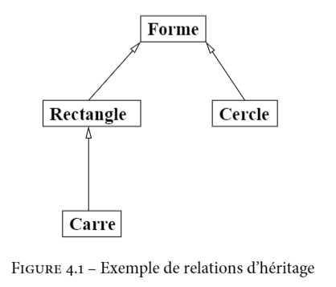

Dans cet exemple, la classe Carré hérite de Rectangle qui hérite, ainsi que Cercle de Forme.
Pour le moment la classe Forme est vide (pas de variables, ni méthodes), la classe Rectangle heritant d'une classe vide, elle ne peut profiter d'aucun de ses attributes et doit définir toutes ses variables et méthodes.
Une notion d'héritage en Java se définit par le mot-clef **extends**:

    public class Rectangle extends Forme {
        private int largeur ;
        private int longueur ;
        public Rectangle(int x, int y) {
        this.largeur = x ;
        this.longueur = y ;
        }
        public int getLargeur() {
        return this.largeur ;
        }
        public int getLongueur() {
        return this.longueur;
        }
        public int surface() {
        return this.longueur * this.largeur;
        }
        public void affiche() {
        System.out.println(”rectangle ” + longueur + ”x” + largeur);
        }
    }   
En revanche, la classe Carre peut bénéficier de la classe Rectangle et ne nécessite pas la réécriture de ces méthodes si celles-ci conviennent à la sous-classe. Toutes les méthodes et variables de la classe Rectangle ne sont néanmoins pas accessibles dans la classe Carre. Pour qu’un attribut
puisse être utilisé dans une sous-classe, il faut que son type d’accès soit **public ou protected**, ou, si les deux classes sont situées dans le même package, qu’il utilise le type d’accès par **défaut**. Dans cet exemple, les variables longueur et largeur ne sont pas accessibles dans la class Carre qui doit passer par les méthodes getLargeur() et getLongueur(), déclarées comme publiques.

##### Redéfinition 

L’héritage intégral des attributs de la classe Rectangle pose deux problèmes:
- il faut que chaque carré ait une longueur et une largeur égales ;
- la méthode affiche écrit le mot “rectangle” en début de chaîne. Il serait souhaitable que ce soit “carré” qui s’affiche.
De plus, les constructeurs ne sont pas hérités par une sous-classe. Il faut donc écrire un constructeur spécifique pour Carre. Ceci nous permettra de résoudre le premier problème en écrivant un constructeur qui ne prend qu’un paramètre qui sera affecté à la longueur et à la largeur. Pour at-
tribuer une valeur à ces variables (qui sont privées), le constructeur de Carre doit faire appel au constructeur de Rectangle en utilisant le mot-clé **super** qui fait appel au constructeur de la classe supérieure comme suit :

    public Carre(int cote) {
        super(cote,cote);
    }

**L’appel au constructeur d’une classe supérieure doit toujours se situer dans un constructeur et toujours en tant que première instruction ; Si aucun appel à un constructeur d’une classe supérieure n’est fait, le constructeur fait appel implicitement à un constructeur vide de la classe supérieure (comme si la ligne super() était présente). Si aucun constructeur vide n’est accessible dans la classe supérieure, une erreur se produit lors de la compilation**.

Le second problème peut être résolu par une redéfinition de méthode. On dit qu’une méthode d’une sous-classe redéfinit une méthode de sa classe supérieure, si elles ont la même signature mais que le traitement effectué est ré-écrit dans la sous-classe. Voici le code de la classe Carre où
sont résolus les deux problèmes soulevés:

    public class Carre extends Rectangle {
        public Carre(int cote) {
        super(cote, cote);
        }
        public void affiche() {
        System.out.println(”carré ” + this.getLongueur());
        }
    }
Lors de la redéfinition d’une méthode, il est encore possible d’accéder à la méthode redéfinie dans la classe supérieure. Cet accès utilise également le mot-clé super comme préfixe à la méthode. Dans notre cas, il faudrait écrire **super.affiche()** pour effectuer le traitement de la méthode
affiche() de Rectangle.
**Enfin, il est possible d’interdire la redéfinition d’une méthode ou d’une variable en introduisant le mot-clé final au début d’une signature de méthode ou d’une déclaration de variable. Il est aussi possible d’interdire l’héritage d’une classe en utilisant **final** au début de la déclaration d’une classe (avant le mot-clé class).**

#### Polymorphisme

**Le polymorphisme est la faculté attribuée à un objet d’être une instance de plusieurs classes.**
Il a une seule classe **réelle** qui est celle dont le constructeur a été appelé en premier (c’est-à-dire la classe figurant après le new) mais il peut aussi être déclaré avec une classe supérieure à sa classe réelle. Cette propriété est très utile pour la création d’ensembles regroupant des objets de classes différentes comme dans l’exemple suivant :

    Forme[] tableau = new Forme[4];
    tableau[0] = new Rectangle(10,20);
    tableau[1] = new Cercle(15);
    tableau[2] = new Rectangle(5,30);
    tableau[3] = new Carre(10);

L’opérateur **instanceof** peut être utilisé pour tester l’appartenance à une classe comme suit :

    for (int i = 0 ; i < tableau.length ; i++) {
        if (tableau[i] instanceof Forme)
            System.out.println(”element ” + i + ” est une forme”);
        if (tableau[i] instanceof Cercle)
            System.out.println(”element ” + i + ” est un cercle”);
        if (tableau[i] instanceof Rectangle)
            System.out.println(”element ” + i + ” est un rectangle”);
        if (tableau[i] instanceof Carre)
            System.out.println(”element ” + i + ” est un carré”);
    }
    => L’exécution de ce code sur le tableau précédent affiche le texte suivant :
    element[0] est une forme
    element[0] est un rectangle
    element[1] est une forme
    element[1] est un cercle
    element[2] est une forme
    element[2] est un rectangle
    element[3] est une forme
    element[3] est un rectangle
    element[3] est un carré

L’ensemble des classes Java, y compris celles écrites en dehors de l’API, forme une hiérarchie avec une **racine unique**. **Cette racine est la classe Object dont hérite toute autre classe**. En effet, si vous ne précisez pas explicitement une relation d’héritage lors de l’écriture d’une classe, celle-ci
hérite par défaut de la classe Object. Grâce à cette propriété, des classes génériques de création et de gestion d’un ensemble, plus élaborées que les tableaux, regroupent des objets appartenant à la classe Object (donc de n’importe quelle classe).
Une des propriétés induites par le polymorphisme est que l’interpréteur Java est capable de trouver le traitement à effectuer lors de l’appel d’une méthode sur un objet. Ainsi, pour plusieurs objets déclarés sous la même classe (mais n’ayant pas la même classe réelle), le traitement associé à
une méthode donné peut être différent. Si cette méthode est redéfinie par la classe réelle d’un objet (ou par une classe située entre la classe réelle et la classe de déclaration), le traitement effectué est celui défini dans la classe la plus spécifique de l’objet et qui redéfinie la méthode.
Dans notre exemple, la méthode affiche() est redéfinie dans toutes les sous-classes de Forme et les traitements effectués sont:

    for (int i = 0 ; i < tableau.length ; i++) {
        tableau[i].affiche();
    }
    => Résultat :
    rectangle 10x20
    cercle 15
    rectangle 5x30
    carré 10

Dans l’état actuel de nos classes, ce code ne pourra cependant pas être compilé. En effet, la fonction affiche() est appelée sur des objets dont la classe déclarée est Forme mais celle-ci ne contient aucune fonction appelée affiche() (elle est seulement définie dans ses sous-classes).
Pour compiler ce programme, il faut transformer la classe Forme en une interface ou une classe abstraite tel que cela est fait dans les sections suivantes.

### Interfaces

**Une interface est un type, au même titre qu’une classe, mais abstrait et qui donc ne peut être instancié (par appel à new plus constructeur). Une interface décrit un ensemble de signatures de méthodes, sans implémentation, qui doivent être implémentées dans toutes les classes qui implémentent l’interface.** 
L’utilité du concept d’interface réside dans le regroupement de plusieurs classes, tel que chacune implémente un ensemble commun de méthodes, sous un même type. 
Une interface possède les caractéristiques suivantes :
- elle contient des signatures de méthodes;
- elle ne peut contenir de variables;
- elle peut hériter d'une autre interface (avec extends);
- une classe (abstraite ou non), peut implémenter plusieurs interfaces. La liste des interfaces implémentées doit alors figurer après le mot-clef **implements** placé dans la déclaration de classe, en séparant chaque interface par une virgule.

Voir dossier TestJava fichier Animal.java et Chèvre.java:

    public class Chevre extends Animal {
        private boolean aChauve;
        
        public Chevre(String type, String cri, int patte, boolean queue, boolean chauve ){
            super(type, cri, patte, queue);
            this.aChauve = chauve;
        }
    }
    =>The extends keyword extends a class (indicates that a class is inherited from another class).In Java, it is possible to inherit attributes and methods from one class to another. We group the "inheritance concept" into two categories:subclass (child) - the class that inherits from another classsuperclass (parent) - the class being inherited fromTo inherit from a class, use the extends keyword.
    =>The super keyword refers to superclass (parent) objects.It is used to call superclass methods, and to access the superclass constructor.The most common use of the super keyword is to eliminate the confusion between superclasses and subclasses that have methods with the same name.

## Types de données

### Variables

>Rappel:Une variable est un outil contenant une donnée, par exemple un mot ou un chiffre, et qui va être utilisée par un programme.Un programme manipule constamment des variables, soit que l'on a définies, soit qu'il a créées.Les variables contiennent des **valeurs**, ces variables sont gérées et enregistrées par l'ordinateur. Pour savoir ce qu'elles contiennent nous leurs donons un nom.

#### Les nommer

Son nom doit reflèter son contenu.

Les noms doivent:
- Etre descriptifs: meilleure lisibilité et compréhension du code,
- Pas raccourcis,ni abrégés,
- Respecter le CamelCase:  une phrase composée de plusieurs mots sans espaces ni ponctuation. Le premier mot est écrit en minuscules et tous les autres mots commencent par une majuscule.

#### Les déclarer

Pour utiliser les variables, il faut les créer, ou **déclarer**.
>Il existe plusieurs types de variables, en fonction du type de valeur qu'elles contiennent.

En Java, par exemple, si la variable contient un nombre entier elle sera déclarée en utilisant le mot clé **int** suivi du nom de la variable? On dit que ce sont des **int**.

Exemple:

    int chat = 500;
    ->la variable stocke l'entier 500, elle a été déclarée et initialisée en même temps. (Assignation d'une valeur de départ)

En Java, chaque instruction se termine par un **;**

Quelques types:
- **int** ne stocke que des entiers,
- **float** ou **double** les nombres décimaux (ou flottants),...

#### Les types primitifs

En plus de ces types primitifs, le terme **void** est utilisé pour spécifier le retour vide ou une absence de paramètres d’une méthode. On peut remarquer que chaque type primitif possède une classe qui encapsule un attribut du type primitif. Par exemple, la classe Integer encapsule un attribut de type int et permet ainsi d’effectuer des opérations de traitement et des manipulations
qui seraient impossibles sur une simple variable de type int.
A l’inverse du langage C, Java est un langage très rigoureux sur le typage des données. Il est interdit d’affecter à une variable la valeur d’une variable d’un type différent si cette seconde variable
n’est pas explicitement transformée. 

Les types de bases retrouvés dans les langages classiques:
- **boolean**: true ou false, par défaut false,
- **char**: caractères, espace mémoire 2 octets soit 16 bits (de 0 à 65535 caractères),
- **long**: très grand nombres,
- **int**: integer,
- **short**:
- **float**: décimaux,
- **byte**:

**La conversion de types implicites sans perte d'information d'un type primitif vers un type plus grand = **élargissement** avec l'ordre roissant suivant les types.

La maîtrise des types permet d'avoir des applications très performantes,  meilleure gestion de l'espace mémoire.

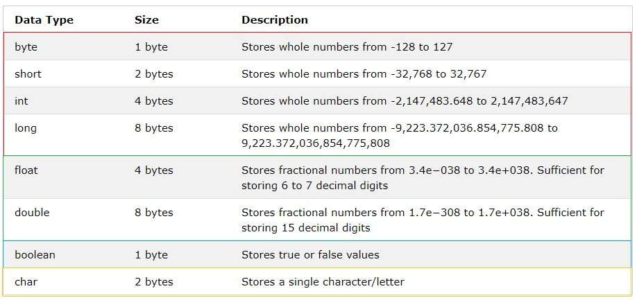

float et double:

[float double](https://www.sololearn.com/Discuss/749938/*in-java-float-a-1-1f-what-is-this-f-stands-for)
>Attribuez une valeur à la variable. Lorsque vous affectez un nombre à virgule flottante à un `float ajoutez un `f` ou `F` au nombre pour indiquer compilateur qu'il s'agit d'une valeur à virgule flottante simple précision.

*Type void et type any: void = aucun type et any = tous les types*.

#### Mélanger des types numériques

Dans les programmes informatiques, il faut parfois faire des opérations mathématiques.
Cependant, les variables utilisées ne seront pas forcèment du même type (tant qu' elles restent numériques).
Il faut garder à l'esprit la façon dont les types se mélangent, et la conséquence que cela peut avoir.

Exemple:

    int a = 5;
    int b = 2;
    int c = a / b;
    =>c =2

    int a = 5;
    int b = 2;
    float c = a / b;
    =>c = 2.0;

    int a = 5;
    float b = 2;
    float c = a / b;
    =>c = 2.5;
    ou avec un cast

    int a = 5;
    int b = 2;
    float c = (float) a / b ;
    =>c = 2.5;

#### Constante

Certaines valeurs n'ont pas besoin d' être modifiées. Elles restent telles qu' elles étaient au début;
Ce sont des **constantes**.
Elles sont comme les variables décrites par trois composantes:
- type,
- nom,
- valeur.

Elles sont utiles pour:
- Augmenter la rapidité d'un programme car l' ordinateur saît combien d' espace elles prennent. Ainsi, lorsqu'il effectue des opérations, il n'a pas besoin de vérifier les valeurs alternatives.
- S'assurer que certaines valeurs ne changent pas notamment par mégarde.

**A utiliser dans la mesure du possible !**

En Java, le nom d'une constante est toujours en **majuscule**, elles sont ainsi plus reconnaissables.
Elles sont déclarées grâce au mot clé **final**.

Exemples:

    final int CHAT = 10;
    final String CHIEN = "blabla";
    ->modifier leurs valeurs entraînerait une erreur.

#### Les booléens

Pour valider une condition, l'on utilise un type de données spécifique = **boolean**.
Une variable de type boolean ne peut contenir que deux valeurs: **true** ou **false**.
Ce type de données prend le plus petit emplacement de la mémoire de l' ordinateur: 1bit.

Exemple:

        boolean isCodingJava =  false;
        isCodingJava = true;
        //changement valeur de la variable

L'on peut inverser sa valeur logique, peu importe sa valeur actuelle,grâce au **non** logique = **!**.

Exemple:

    boolean isCodingJava = true;
    isCodingJava = !isCodingJava;
    =>devient false

### Le type String

**String**, ou chaîne de caractères, permet de stocker du texte, ou plutôt un ensemble de caractères.
Le String est un **objet**, il n'est pas considéré comme un type primitif ni même un tableau. On utilise la classe String fournie dans le package java.lang.

Exemple:

    String city = "Nice";
    String pet;
    String cat = "";

#### Concaténation des variables de type String

Exemple:

    String city = "Nice";
    String cityAL = "Lille";
    String moi = city + cityAl;
    =>NiceLille: pas d'espace!

    String city = "Nice";
    String cityAL = "Lille";
    String moi = city+ " " +cityAl;
    =>Nice Lille

L'on peut concaténer avec d'autres type de données:

    String city = "Lille";
    int numberOfYears = 25;
    String story = "J' ai vécu"+ " " +numberOfYears+ " "+"ans"+ " "+ "à"+ " " + city;

L'opérateur + permet la concaténation des chaînes et des nombres.

### Bases numériques

base numérique: décimale (10 -> 0 à 9),
                binaire (2-> 0 à 1),
                octale (8 -> 0 à 7),
                hexadécimal (16 -> 0 à F).
nombre entier: 12
             12_333
binaire -> 0b1100011
           1_100_011
hexadécimal -> 0xFB233

#### Modifier les valeurs des variables avec les opérateurs

ne variable peut varier c'est à dire changer de valeur.
Elle peut varier grâce à des **opérateurs**.

>Les règles arithmétiques s'appliquent! L'on utilise les () pour décider des opérations prioritaires.

|Opérateur|Usage|
|-----------:|---------:|
|+|addition|
|-|soustraction|
|*|multiplication|
|/|division|

    

Exemple:

    public class ManipulationVariables {
        public static void main(String[] args) {
            int epargne = 500;
            int revenus = 2000;
            //Ajoutez 100 à votre épargne (Yeah!)
            epargne = epargne + 100;

            //Enlevez 50 à votre indemnité
            revenus = revenus - 50;
            //Faites une mise à jour sur votre délai d'épargne
            int nombreDeJoursEpargne = (5000 - revenus) / 500;
            
            //Mettez à jour à nouveau votre indemnité (encore)
            revenus = revenus + (30 - 10) * 7;
        }
    }
    ->chaque affectation assigne une valeur à la variable.
Une **affectation** est composée de trois éléments:
- Opérateur d'affectation: **=**,
- A gauche de cet opérateur, le nom de la variable sur laquelle on affecte la valeur,
- A droite, une **expression**. Une expression, est une affectation qui produit une valeur.
  
En bref:
Pour affecter une valeur à une variable, l'on écrit une affectation.
Elle se compose du nom de la variable, suivi de l'opérateur d' affectation, et ensuite de l' expression qui produit une valeur correspondant au type de la variable.

#### Ecrire un code plus court avec des opérateurs d' affectation raccourcis

Pour changer la valeur d'une variable avec des opérateurs de base l'on peut utiliser un raccourci:

    epargne = epargne + 100;
    =>
    epargne += 100;

Cela fonctionne donc avec:
-=
*=
/=

#### Manipuler d' autres données que les nombres

Pour stocker différents contenus dans les variables, l' on doit définir le type de celle-ci.
En effet, en fonction du type, les variables stockées dans la mémoire de l'ordinateur ne prennent pas la même place.

Il existe les variables:
- texte: **String**,
- entier: **int**,
- float: **double** ou **float**.
  
Exemple de déclaration de variables:

    String text = "blabla";
    int numberOfCat = 10;
    double percentage = 0.0d;

### Tableaux et matrices

**Une variable est déclarée comme un tableau dès lors que des crochetssont présents soit après son type, soit après son identificateur**. 
Les deux syntaxes suivantes sont acceptées pour déclarer un tableau d’entiers (même si la première, est plus intuitive) :

    int[] monTableau;
    int monTableau2[];

Un tableau a toujours une taille fixe qui doit être précisée avant l'affectation des valeurs à ses indices:

    int[] monTbaleau = new int[20];

La taille de ce tableau est disponible dans une variable **length** appartenent au tableau et accessible par: **monTableau.length**.
**On peut également créer des matrices ou des tableaux à plusieurs dimensions en multipliant les crochets**:

    int[][] maMatrice;

## Structures de contrôle

Voir chapitre exercices => Main.app

Les structures de contrôle permettent d’exécuter un bloc d’instructions soit plusieurs fois (instructions itératives) soit selon la valeur d’une expression (instructions conditionnelles ou de
choix multiple). Dans tous ces cas, un bloc d’instruction est
● soit une instruction unique ;
● soit une suite d’instructions commençant par une accolade ouvrante “{” et se terminant par une accolade fermante “}”

### Instructions conditionnelles

Syntaxe :

    if (<condition>) <bloc1> [else <bloc2>]
    ou
    <condition> ? <instruction1> : <instruction2>;
    => <condition> doit renvoyer une valeur booléenne. Si celle-ci est vraie c’est <bloc1> (resp.<instruction1>) qui est exécuté sinon <bloc2> (resp. <instruction2>) est exécuté. La partie
    else <bloc2> est facultative

        if (a == b) {
            a = 50 ;
            b = 0 ;
            } else {
            a = a - 1 ;
        }

### Instructions itératives

Les instruction itératives permettent d’exécuter plusieurs fois un bloc d’instructions, et ce, jusqu’à ce qu’une condition donnée soit fausse. 
Les trois types d’instruction itératives sont les
suivantes :

- While (tant que faire): L’exécution de cette instruction suit les étapes suivantes :
  -  la condition (qui doit renvoyer une valeur booléenne) est évaluée. Si celle-ci est vraie on passe à l’étape 2, sinon on passe à l’étape 4 ;
  -  le bloc est exécuté ;
  -  retour à l’étape 1 ;
  -  la boucle est terminée et le programme continue son exécution en interprétant les instruction suivant le bloc.

Syntaxe:

    while (<condition>) <bloc>
    while (a != b) a++;

- Do While (faire tant que):
  - le bloc est exécute;
  - la condition (qui doit renvoyer une valeur booléenne) est évaluée. Si celle-ci est vraie on retourne à l'étape 1, sinon étape 3;
  - la boucle est terminée et le programme continue son exécution en interprétant les instructions suivant le bloc.

Syntaxe:

    do <bloc> while (<condition>);
    do a++
    while (a != b);

- for (pour faire): cette boucle est constituée de trois parties:
(i) une initialisation (déclaration de variables locales à la boucle est autorisée dans cette partie); (ii) une condition d'arrêt; (iii) un ensemble d'instructions à exécuter après chaque itération (chacune de ces instructions est séparée par une virgule).
  -  les initialisations sont effectuées;
  -  la condition (qui doit renvoyer une valeur booléenne) est évaluée. Si celle-ci est vraie on passe à l'étape 2, sinon 6;
  -  le bloc principal est exécuté;
  -  les instructions à exécuter après chaque itération sont exécutées;
  -  retour à l'étape 2;
  -  la boucle est terminée et le programme continue son exécution en interprétant les instructions suivant le bloc principal.

Syntaxe:

    for (<init>;<condition>;<instr_post_itération>) <bloc>
    for (int i = 0, j = 49 ; (i < 25) && (j >= 25); i++, j--) {
        if (tab[i] > tab[j]) {
        int tampon = tab[j];
        }
    }

### Instructions break et continue

L’instruction **break** est utilisée pour sortir immédiatement d’un bloc d’instructions (sans traiter les instructions restantes dans ce bloc). 
Dans le cas d’une boucle on peut également utiliser l’instruction **continue** avec la différence suivante :
- break : l’exécution se poursuit après la boucle (comme si la condition d’arrêt devenait vraie) ;
- continue : l’exécution du bloc est arrêtée mais pas celle de la boucle. Une nouvelle itération du bloc commence si la condition d’arrêt est toujours vraie.
- 
 >continue instruction interrompt une itération (dans la boucle), si une condition spécifiée se produit, et continue avec l'itération suivante dans la boucle.

Syntaxe:

    for (int i = 0, j = 0 ; i < 100 ; i++) {
        if (i > tab.length) {
        break ;
        }
        if (tab[i] == null) {
        continue ;
        }
        tab2[j] = tab[i];
        j++;
    }

## Ecrire une fonction

### Notion de classe

Une **classe** est un ensemble de:
- Variables, nommées **attributs**,
- Et de **comportements**, nommés **méthodes**.

Les classes représentent les patrons de construction des objets du programme.

Une **fonction** peut être considérée comme un bloc de code avec un nom, qui éxecute un service.
La fonction **main**: le service effectué est le programme lui-même.
Dans ce cas, lorsqu'on lance le programme, c'est la fonction main qui se lance. Elle est également appelée **point d'entrée**.

Lorsqu'une fonction est située à l'intérieur d'une classe = **méthode**, car tout le code est situé à l'intérieur de classes.

>Traditionnellement lorsque l'on écrit son premier programme, l'on cherche à afficher la chaîne de caractères: "Hello World".

    package hello;

    public class HelloWorld {
        //*Le programme commence ici*/
        public static void main(String[] args){
            System.out.printIn("Hello Wordl!");
        }
    }
    
    -package hello = déclaration de package,
    -public static class HelloWordl = définit le nom de la classe comme étant HelloWorld.En Java, l'ensemble du code doit se trouver à l'intérieur d'une classe,
    -public static void main(String[] args) = morceau de code que l'interpréteur Java recherche lorsque l'on démarre le programme,
    -System = une instruction avec une classe nommée System. Cette classe n'a pas besoin d'être instanciée pour être utilisée,
    - System.out.printIn("Hello Wordl!") = instruction qui affiche le message attendu.

>Deux étapes sont importantes pour qu'un programme Java se lance: la **compilation** et l'**interprétation**. Le compilateur intervient en amont pour prendre le code du développeur et le transformer en byteCode (ou code binaire-langage machine). Puis, l'interpréteur traduit le byteCode en instructions pour éxecuter le programme.

/** */ = commentaires de documentation

=>Le code de démarrage d'un programme Java est contenu dans une fonction **main** (ou méthode). Cette fontion est elle-
même contenue dans une classe, et cette classe appartient à un package.

Dans certains cas, il est plus judicieux d’attacher une variable ou une méthode à une classe plutôt qu’aux objets instanciant cette classe. Par exemple, la classe java.lang.Integer possède une variable MAX_VALUE qui représente la plus grande valeur qui peut être affectée à un entier.
Or, cette variable étant commune à tous les entiers, elle n’est pas dupliquée dans tous les objets instanciant la classe Integer mais elle est associée directement à la classe Integer. Une telle variable est appelée variable de classe. De la même manière, il existe des méthodes de classe qui
sont associées directement à une classe. Pour déclarer une variable ou méthode de classe, on utilise le mot-clé **static** qui doit être précisé avant le type de la variable ou le type de retour de la méthode.

>la méthode main des classes exécutables est une méthode de classe car elle est appelée directement à partir d’une classe ; Lors de l’affichage d’une chaîne de caractères à l’écran par l’instruction System.out.println(...), on fait appel à la variable out de la classe java.lang.System qui est un objet représentant la sortie standard (l’écran) et sur laquelle on appelle la méthode println permettant d’afficher une chaîne de caractères.

------------------------------------------------ 

## Modélisation, conception

### UML

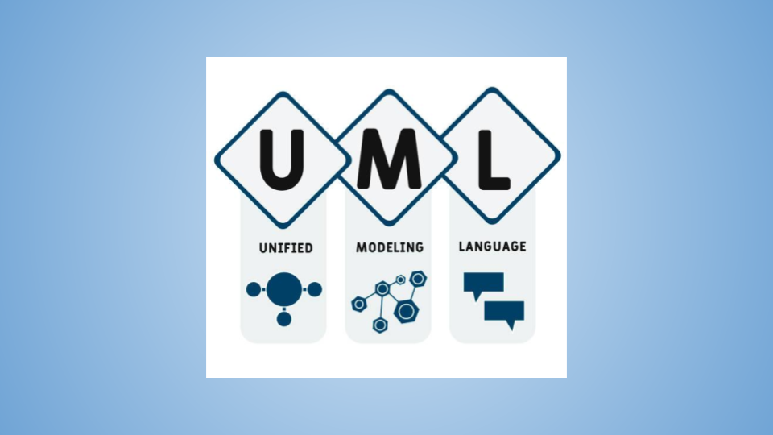
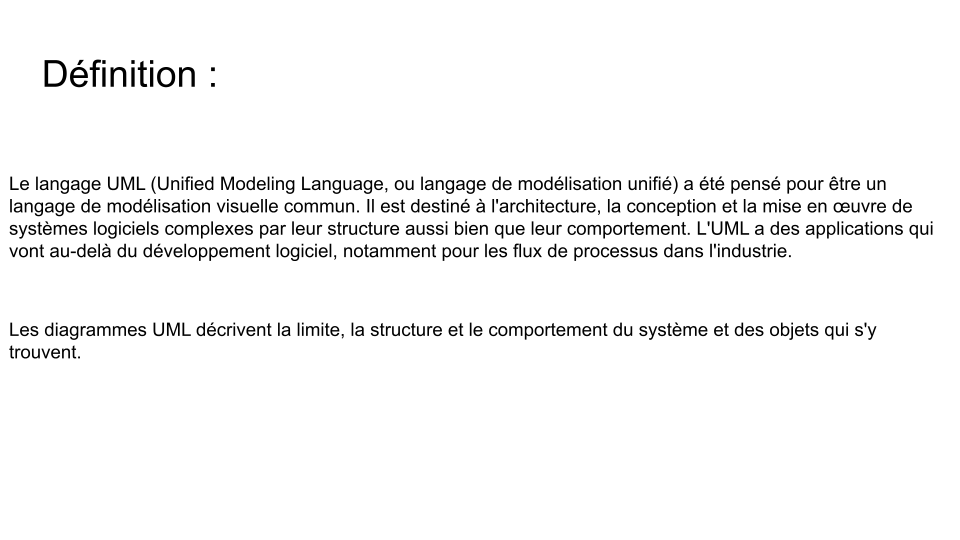
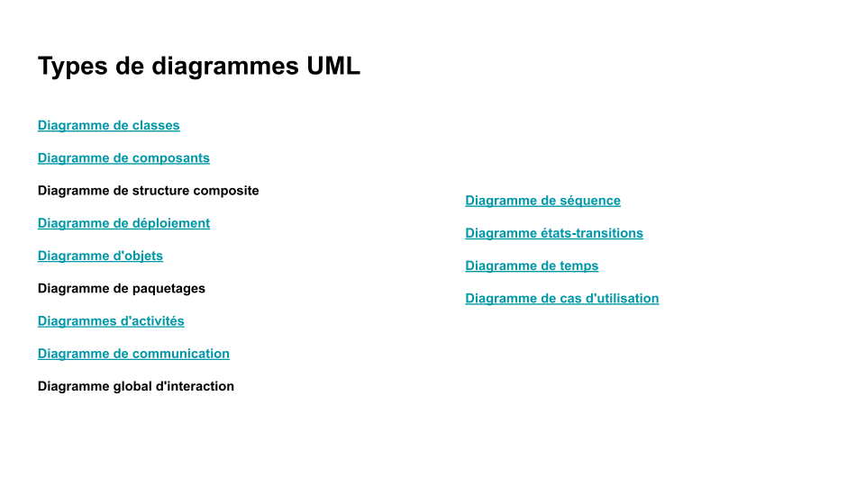
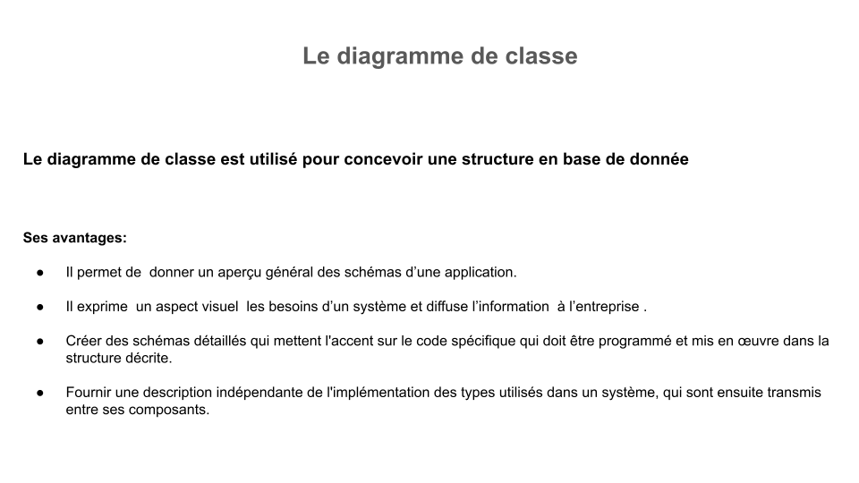
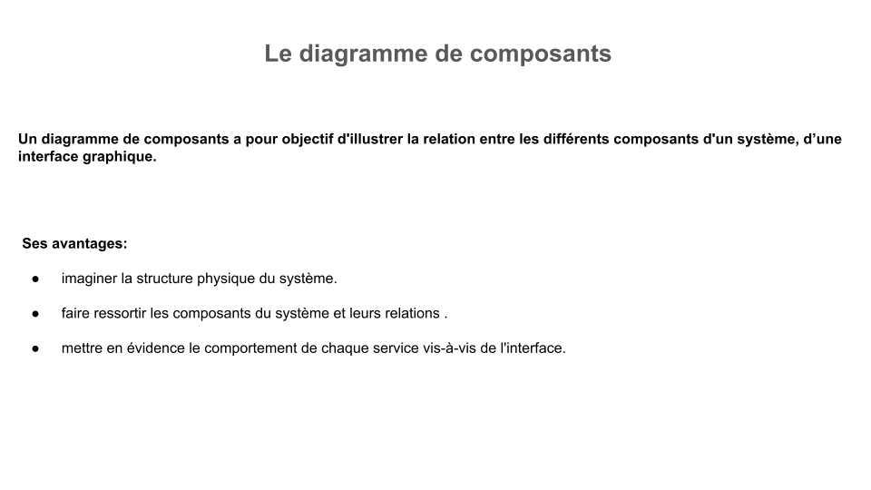
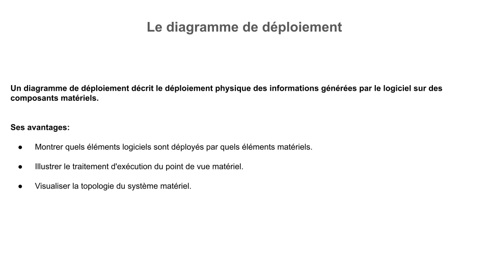

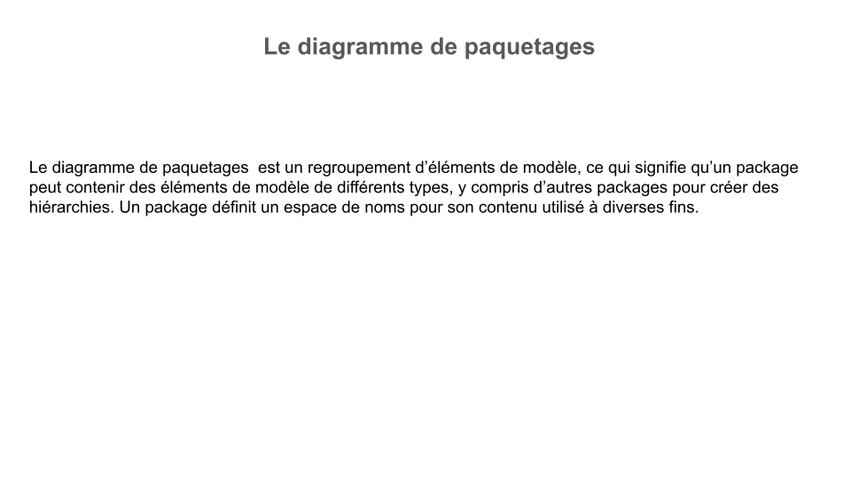
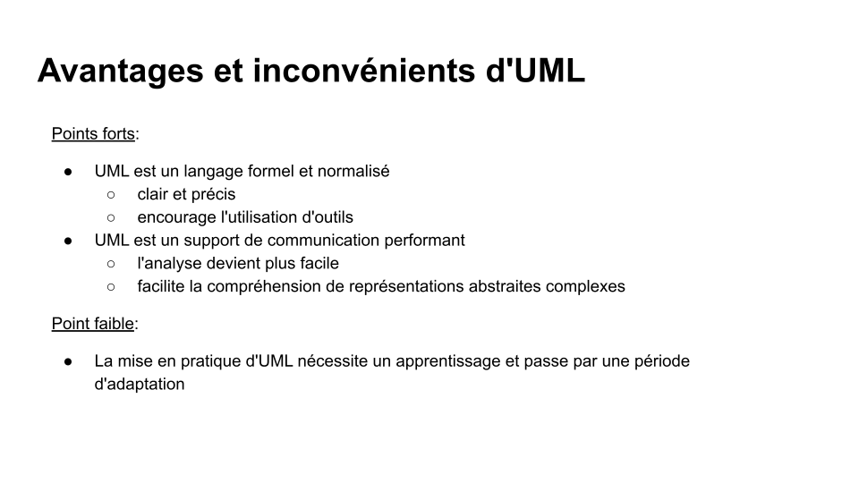

### Diagrammes de classe

## Exercices

### Syntaxe

[Exercices de syntaxe](https://www.w3schools.com/java/java_syntax.asp)
=> System.out.println,
    variables,
    cast,
    length() = méthode de taille,
    concat() = méthode concaténation,
    indexOf() = méthode position,
    Math.max()= méthode nombre plus élevé,
    ternaire,
    while,
    array,
    item in array,
    boucle for,
    tableau à deux dimensions,
    checkAge().

    int x = 5, y = 6, z = 50;
    System.out.println(x + y + z);

    int myNum = 9;
    float myFloatNum = 8.99f;
    char myLetter = 'A';
    boolean myBool = false;
    String myText = "Hello World";

    double myDouble = 9.78d;
    int myInt = (int) myDouble;
    ->Le cast est le fait de forcer le compilateur à considérer une variable comme étant d’un type qui n’est pas le type déclaré ou le type réel de la variable.
    [cast Java](http://www.javacoding.fr/le-cast-en-java-downcasting-et-upcasting/)

    String txt = "Hello";
    System.out.println(txt.length());
    ->Use the correct method to print the length of the txt string

    String firstName = "John ";
    String lastName = "Doe";
    System.out.println(firstName.concat(lastName));
    ->Use the correct method to concatenate two strings

    String txt = "Hello Everybody";
    System.out.println(txt.indexOf("e"));
    ->Return the index (position) of the first occurrence of "e" in the following string

    int x = 5;
    int y = 10;
    Math.max(x, y);
    -> Use the correct method to find the highest value of x and y

    int time = 20;
    String result = (time < 18) ? "Good day." : "Good evening.";
    System.out.println(result); 
    ->Insert the missing parts to complete the following "short hand if...else statement" (ternary operator)

    int i = 1;
    while (i < 6) {
    System.out.println(i);
    i++;
    }
    ->Imprimer i tant que iest inférieur à 6

    String[] cars  = {"Volvo", "BMW", "Ford"};
    ->Create an array of type String called cars

    String[] cars = {"Volvo", "BMW", "Ford"};
    System.out.println(cars[1]);
    ->Print the second item in the cars array

    String[] cars = {"Volvo", "BMW", "Ford"};
    for (String i : cars ) {
    System.out.println(i);
    }
    ->Loop through the items in the cars array

    int[][] myNumbers = { {1, 2, 3, 4}, {5, 6, 7} };
    ->Insert the missing parts to create a two-dimensional array

    // Create a checkAge() method with an integer variable called age
    static void checkAge (int age) {
    // If age is less than 18, print "Access denied"
    if (age < 18) {
        System.out.println("Access denied"); 

    // If age is greater than, or equal to, 18, print "Access granted"
    } 
    else
    {
        System.out.println("Access granted"); 
    }
    } 

    public static void main(String[] args) { 
    // Call the checkAge method and pass along an age of 20
    checkAge
    (20);
    }

### Dossier TestJava

Dans cet exercice, Main correspond à la classe.

Ouvrir bloc-notes, puis le renommer MainApp.java.
Ouverture via VS Code.
**Notre fichier représente une classe**.
Il existe deux conventions avec les {}:

    class MainApp {
        
    }
    ou:
    class MainApp 
    {

    }
Java va toujours exécuter le premier main.

#### Fichier APP.java

    import java.util.Scanner;
    // import bibliothèque interne de Java, utilisation de la méthode Scanner

    public class App 
    {
        public static void main(String[] args)
        {
            Chat c = new Chat("David", 55, true);
            Chat felix = new Chat("Felix", 44, false);
            // System.out.println(c.mAge);
            // Affichage de l'attribut âge de c :55
            // System.out.println(c.mName);
            // => error the fiel Cht.mName is not visible car en private = encapsulé!
            // name(c);
            //=> appel fonction name pour le chat c
            // user(c);
            // presentation(c);
            felix.setVaccin(true);
            //envoie données à l'objet felix
            System.out.println(felix.getVaccin());
        }

        public static void name(Chat chat)
        {
            // System.out.println(c.mAge);
            // System.out.println(c.mName);
            // public. erreur, n'affiche pas la donnée
            // String cName = c.getName();
            System.out.println("c.mName: "+ chat.getName());
            // https://codegym.cc/fr/groups/posts/getters-et-setters-en-java
            // https://www.w3schools.com/java/java_encapsulation.asp
        }

        public static void user(Chat chat)
        {
            Scanner saisieUser = new Scanner(System.in);
            System.out.println("Veuillez saisir m pour faire miauler le chat sinon y pour faire aboyer le chien");
            String i = saisieUser.nextLine();
            String miaule = "m";
            System.out.println((i.equals(miaule)) ? "Le chat "+ chat.getName() +" fait miaou-miaou"  : "Le chien fait ouaf_ouaf");
            // La equals()méthode compare deux chaînes et renvoie true si les chaînes sont égales et false sinon.
        }

    }
    // Le constructeur a une mission primordiale: être le patron, tous les arguments doivent être présent

    /*
    * public static void presentation(Chat chat) {
        String question = "Voulez vous que je miaule? (y/n)";
        boolean continuePresentation = true;
        do {
            System.out.println(question);
            Scanner saisieUtilisateur = new Scanner(System.in);
            String resp = saisieUtilisateur.next();

            if (resp.equals("y")) {
                System.out.println(chat.getName() + "miaou");
                continuePresentation = false;
                saisieUtilisateur.close();
            } else if (resp.equals("n")) {
                    System.out.println("bye");
                    continuePresentation = false;
                    saisieUtilisateur.close();
            } else {
                question = "Je n'ai pas compris, y ou n?;
                continuePresentation = true;
            }       
        }
        while(continuePresentation);
    }
    */

#### PowerShell

Recherche power -> windows powershell, saisir le chemin après le chemin courant :cd suivi de ->  Desktop\GIT\TestJava.
Cela change le chemin courant (cd permet de changer le répertoire).
Puis ls entrée pour avoir le dossier et son contenu.

Ensuite, saisie de javac ./MainApp.java pour compiler le code.

Le code pourra être exécuté => java MainApp

#### Fichier MainApp.java

En langage orienté objet nous sommes obligé d'avoir au minimum une classe (classe minimale). Le code ne pourrait s'exécuter.
Ici = class MainApp. 

    public class MainApp 
    {
        public static void main (String[] args)
            {
            /*Signature, publique: accessible partout, la JVM peut y *avoir accès. Recherchée par Java:les arguments ou *paramètres Liste de String
            *Ce qui est dans la méthode sont des arguments
            *Dans méthode main de type void, on peut placer des arguments. Mais Java doit reconnaître la signature.
            *static est accessible ici*/

                System.out.println("Hello You!!!");

            */équivalent de console.log, on doit indiquer la sortie
            *System est un objet auquel on applique la méthode println*/
            }
    }

    public class MainApp 
    {
        public static void main (String[] args)
        {
            int maVariable = 36;
            /*déclaration d'une variable entier
            *déclaration variable pas d'espace, accent, espace. *Commence par une lettre ou underscore: camelCase ou *snake_case*/
            System.out.println(maVariable);
            maVariable = 37;
            System.out.println(maVariable);
            maVariable = maVariable + 1;
            System.out.println(maVariable);
            autreMethode();
            // ne fonctionne pas car dans la methode autreMethode pas de static, il faut permettre l'accès au code
        }
        //public void autreMethode()
        public static void autreMethode()
        {
            System.out.println("test");
            // rien ne s'affiche car pas invoqué dans main, il faut l'invoquer dans la méthode main
        }
    }
    // "index" appelé, exécuté, la méthode main sera exécutée, c'est l'index de l'index

    public class MainApp 
    {
        public static void main (String[] args)
        {
            final int MAVARIABLE = 36;
            System.out.println(MAVARIABLE); 
            /*MAVARIABLE = 37;
            *System.out.println(MAVARIABLE);
            *error because const*/
        }
    }

    public class MainApp 
    {
        public static void main (String[] args)
        {
            // final float PI = 3.14;
            // error
            // final double PI = 3.14;
            final float PI = 3.14f;
            System.out.println(PI);
            /*https://www.sololearn.com/Discuss/749938/*in-java-float-a-1-1f-what-is-this-f-stands-for
            *Attribuez une valeur à la variable. Lorsque vous *affectez un nombre à virgule flottante à un `float`, *ajoutez un `f` ou `F` au nombre pour indiquer au *compilateur qu'il s'agit d'une valeur à virgule *flottante simple précision.*/
        }
    }

##### Conditions

    public class MainApp 
    {
        public static void main (String[] args)
        {
            boolean value = (24 == 24);
            System.out.println(value);
            //renvoie true

            boolean value1 = (24 === 24);
            System.out.println(value);
            // renvoie true
            //comparaison d'expression

            int age = 24;
            int age1 = 20;
            boolean value = (age == age1);
            System.out.println(value);
            // envoie false

            int age2 = 24;
            int age3 = 24;
            boolean value1 = (age2 === age3);
            System.out.println(value1);
            // renvoie true
            int value4 = 24;
            if (value4 == 24){
                System.out.println(value4);
            }
            // renvoie 24
            if (value4 == 24){
                System.out.println(value4);
            }
            // ne renvoie rien

            int ageAd = 20;
            if (ageAd >= 18 && ageAd < 64){
                System.out.println(ageAd);
            }else{
                System.out.println("non");
            }
            ou
            if (ageAd >= 18 && ageAd < 64)
                System.out.println(ageAd);
            else
                System.out.println("non");
            ou
            String result = (ageAd >= 18 && ageAd < 64) ? "ageAd" : "non"; 
            System.out.println(result);

            //S'il est majeur, on vérifie qu'il a la majorité internationale
            if (ageAd >= 18 && ageAd < 64){
                System.out.println("Vous êtes majeur");
                if(ageAd >= 21){
                    System.out.println("Vous êtes majeur dans tous les pays");   
                }else{
                    System.out.println(" en France seulement");
                }
            }else{
                System.out.println("mineur");
            }

            switch (ageAd){
                case 17:
                    System.out.println("mineur");
                    break;
                case 18, 19, 20:
                    System.out.println("majeur en France");
                    break;
                default:
                    System.out.println("majeur dans tous les pays");
                    break;
            }
        }
    }

##### Boucles

    public class MainApp 
    {
        public static void main (String[] args)
        {
            int i = 0;
            while(i != 20){
                System.out.println(i);
                // i != 2 => boucle infinie, aucune condition d'arrêt: ajout d'incrémentation ou valeur pour en sortir
                // i+=2;
                // si l'on met un break à la place de i+=2 => une seule exécution
                if (i == 10){
                    break;
                }
                i++;
                // si i différent de 20, je renvoie i et si i == 10 stop
            }
            int i = 0;
            while(i != 20){
                if (i == 10){
                    continue;
                    // continue instruction interrompt une itération (dans la boucle), si une condition spécifiée se produit, et continue avec l'itération suivante dans la boucle.
                }
                i++;
                System.out.println(i);
            }
        }
    }

    public class MainApp 
    {
        public static void main (String[] args)
        {
            int i = 0;
            do{
                i++;
                if (i == 10){
                    continue;
                }
                System.out.println(i);
            }
            while(i != 20);
        }
    }

    public class MainApp 
    {
        public static void main (String[] args)
        {
            int i = 0;
            do{
                i++;
                if (i % 2 != 0){
                    continue;
                }
                System.out.println(i);
            }
            while(i != 20);
        }
        // affiche les nombres pairs, continu bloque les impairs suite à la condition if
    }

    //afficher saisie user: scanner. Pour que Java puisse lire ce que vous tapez au clavier, vous allez devoir utiliser un objet de type Scanner. Cet objet peut prendre différents paramètres. !import -> toujours en haut du code

    import java.util.Scanner;
    public class MainApp 
    {
        public static void main (String[] args)
        {
            Scanner valeurDebut = new Scanner(System.in);
            // instance de scanner
            System.out.println("Veuillez saisir un entier :");
            int i = valeurDebut.nextInt();
            Scanner valeurFin = new Scanner(System.in);
            System.out.println("Veuillez saisir un entier :");
            int fin = valeurFin.nextInt();
            valeurDebut.close();
            valeurFin.close();
            // attention à la fermeture du scanner
            
            if (i > fin){
                System.out.println("la valeur de début doit être plus petite que celle de fin");
            }
            else{
                System.out.println("Vous avez choisi: " + i +" "+ fin + ",les valeurs paires entre ces chiffres sont:");
                do{
                    i++;
                    if (i % 2 != 0){
                        continue;
                    }
                    System.out.println(i);
                }
                while(i != fin);
            }
        }
    }
    /

    public class MainApp 
    {
        public static void main (String[] args)
        {
            
            for (int i = 0; i < 10; i++){
                System.out.println(i);
            }
            
            // L’itération sur une collection à l’aide de structures de boucles traditionnelles comme la boucle for exige de connaître le nombre exact d’éléments dans la collection et elle permet également d’introduire des erreurs. Ce qui n’est pas du tout souhaité, surtout lorsque l’on traite du Big Data, car en plus de traiter une masse importante de données, la moindre erreur peut être fatale.
        }
    }

### Dossier Java_variable_de_classe_heritage

Variable de classe Java et héritage

1- Création de la classe abonnement, et création de deux instances de la classe.

2- Création d'une classe voiture.

3- Faire valeurs par défaut, dans une classe mère et fille.
Faire classe animal, et classe chat et chien.

## Nota Bene

\n: retour à la ligne
\t: tabulation
\f: nouvelle page (file)
\r: retour chariot avec saut de ligne
\b: retour en arrière

## Sources

[Open classroom](https://openclassrooms.com/fr/courses/6173501-apprenez-a-programmer-en-java/6313896-declarez-des-variables)
[jar](https://fr.wikipedia.org/wiki/JAR_(format_de_fichier))
[Java SE et EE](https://www.ibm.com/docs/fr/odm/8.9.1?topic=application-java-se-java-ee-applications)
[sololearn](https://www.sololearn.com/Discuss/749938/*in-java-float-a-1-1f-what-is-this-f-stands-for)
[développons en Java](https://www.jmdoudoux.fr/java/dej/chap-javadoc.htm)

## Maj

Voir pdf.
Tous les éléments doivent être du même type dans un tableau.
toString renvoie représentation du tableau. copie du tableau.

Pas de multihéritage (plusieurs extends) en Java, classe abstraite fait hériter  mais pas instanciée.

Formes d’héritage en Java

Java prend en charge quatre formes d’héritage :

1. l’héritage simple : Une classe enfant ne peut hériter que d’une seule classe parentale.
2. Héritage à plusieurs niveaux : Une classe enfant peut hériter d’une classe parent, qui à son tour peut hériter d’une autre classe parent.

3. l’héritage hiérarchique : Une classe enfant peut hériter d’une classe parentale qui a plusieurs classes enfantines.

4. héritage hybride : Une combinaison de deux formes d’héritage ou plus.

Pourquoi l’héritage multiple est-il interdit en Java ?

L’héritage multiple est la capacité d’une classe à hériter des propriétés et du comportement de plus d’une classe mère. Bien que cette fonctionnalité semble utile, elle peut entraîner plusieurs problèmes :

1. Problème du diamant : si deux classes mères ont une méthode portant le même nom et la même signature, la classe enfant ne peut pas décider de laquelle hériter. Cela peut entraîner des ambiguïtés et des erreurs.

2. Complexité : L’héritage multiple peut rendre le code plus complexe et difficile à comprendre.
3. fragilité : Si l’une des classes mères change, cela peut affecter le comportement de la classe enfant de manière inattendue.

Pollution de l’espace de noms : L’héritage multiple peut entraîner des conflits de noms et une pollution de l’espace de noms

**Interface liens direct entre eux mais pas mêmes fonctions**
Une interface est implémentée,on peut en implémenter plusieurs.

 Les interfaces et les classes abstraites sont similaires dans le sens où elles sont toutes les deux utilisées pour définir des contrats ou des modèles que d'autres classes doivent suivre. Cependant, il y a quelques différences clés entre elles.

Une classe abstraite est une classe qui ne peut pas être instanciée directement, ce qui signifie que tu ne peux pas créer un objet à partir d'une classe abstraite. Elle sert plutôt de modèle ou de base pour d'autres classes qui en héritent. Une classe abstraite peut avoir à la fois des méthodes concrètes (avec une implémentation) et des méthodes abstraites (sans implémentation). Les méthodes abstraites sont des méthodes qui n'ont pas de corps et doivent être implémentées par les classes dérivées.

Une interface, en revanche, est un ensemble de méthodes abstraites (méthodes sans implémentation) qui définissent les actions que les classes qui les implémentent doivent prendre. Contrairement à une classe abstraite, une interface ne peut pas contenir de méthodes concrètes avec une implémentation. En plus des méthodes, une interface peut également définir des constantes. Les classes qui implémentent une interface doivent fournir une implémentation pour toutes les méthodes définies par l'interface.

En résumé, une classe abstraite peut fournir à la fois des méthodes avec et sans implémentation, et elle est destinée à être utilisée comme une classe de base pour l'héritage. Une interface, en revanche, ne contient que des méthodes abstraites et des constantes, et elle définit un contrat que les classes qui l'implémentent doivent suivre.

Il est important de noter qu'une classe peut hériter d'une seule classe abstraite, mais elle peut implémenter plusieurs interfaces. Cela permet une plus grande flexibilité dans la conception et permet à une classe de fournir différentes fonctionnalités en implémentant différentes interfaces.

Interface , Qu'est-ce que c'est ? Une interface en programmation est un ensemble de méthodes (ou fonctions) et de constantes définies dans un langage de programmation. Elle définit les actions que peut effectuer un objet ou une classe, sans fournir de détails sur la manière dont ces actions sont réalisées. En d'autres termes, une interface définit ce qu'un objet peut faire, mais pas comment il le fait.