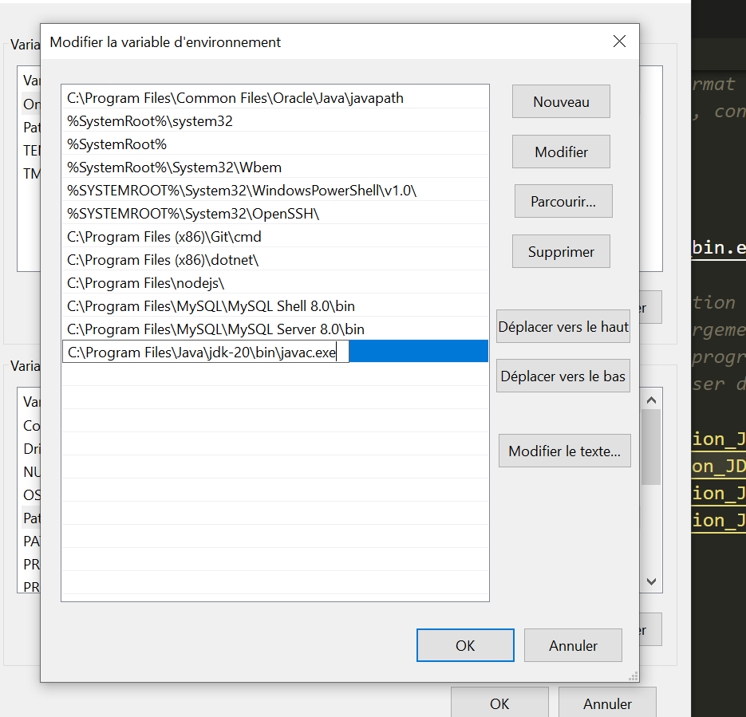

# JAVA cours

## Sofiane:

### Généralités

**Portable**: peut fonctionner sur n'importe quel langage d'exploitation.
Robuste, sécurisé, empêche de compiler si bug.
Langage de haut niveau: peu permissif.
Orienté objet.
Multi-plateforme.
Permet de développer des jeux vidéos, systèmes embarqués, logiciels, des choses graphiques, CRM...
Offre l'avantage d'avoir des bibliothèques déjà comprises dans le langage Java.

**Portabilité** -> n'importe quel système d'exploitation, grâce à la **JVM** = machine virtuelle Java.
Traduit le code Java en code binaire.

Orienté objet différent multi-paradigme (comme JS).

**POO = Programmation Orienté Objet**.

Création de programme robuste et facile à maintenir.

Langage très vaste!

>Lorsqu’un programmeur écrit une application Java, le code compilé (appelé bytecode) s’exécute sur la plupart des systèmes d’exploitation (OS), y compris Windows, Linux et Mac OS. Java tire une grande partie de sa syntaxe des langages de programmation C et C++. La plate-forme Java (l’environnement dans lequel un programme s’exécute) se distingue du fait qu’elle s’exécute sur d’autres plateformes matérielles. Elle comporte deux composants : la machine virtuelle Java (Java VM) et l’interface de programmation d’applications Java (API Java).Java a été développée au milieu des années 1990 par James A. Gosling, un ancien informaticien de Sun Microsystems, avec Mike Sheridan et Patrick Naughton.Tous les programmes sont constitués d’entités représentant des concepts ou des choses physiques appelées « objets ». Les programmes Java se trouvent dans les ordinateurs de bureau, les serveurs, les appareils mobiles, les cartes à puce et les disques Blu-ray (BD). Le développement de programmes Java nécessite un kit de développement logiciel Java (SDK), qui comprend généralement un compilateur, un interpréteur, un générateur de documentation et d’autres outils utilisés pour produire une application complète.Le temps de développement peut être accéléré grâce à l’utilisation d’environnements de développement intégrés (IDE) – tels que JBuilder, Netbeans, Eclipse ou JCreator. Les IDE facilitent le développement d’interfaces graphiques, qui incluent des boutons, des zones de texte, des panneaux, des cadres, des barres de défilement et d’autres objets via des actions de glisser-déposer et de pointer-cliquer.

>La plate-forme Java est indépendante et peut fonctionner sur tous les systèmes d’exploitation disponibles en ce qui concerne son développement et sa compilation. Cela est possible du fait du bytecode, un code qui est compréhensible par la machine. La plateforme se compose du langage Java, du kit de développement Java (JDK), de l’environnement d’exécution Java (JRE), du compilateur Java et de la « Java Virtual Machine » (JVM).

Oracle a racheté Java et en ont fait une licence GNU, semi-opensource.

JSE, JEE, JSK, ...
Java Standard Edition, Java Enterprice Edition, Java Software Kit, ...

**IoT**: internet des objets, utilisés au quotidien. 
Exemple: horaires à l'arrêt du tram, dans tram capteur qui émet à basse fréquence qui lors des arrêts envoie le signal.

### Mise en place

- JSE: environnement d'exécution standard de jJava, outils, bibliothèques...  Java Standard Edition.
- JDK: Ensemble d'outils nécessaires au développement (regroupe le JSE et outils de compilation (**javac**), JRE, outil de création jar: extension .jar = ). Pour les développeurs. Java Development Kit.
- JRE: plateforme Java, Java Runtime Envirronement, environnement d'exécution. Pour les user d'application, sans les développer.

>JAR (format de fichier): En informatique, un fichier JAR (Java archive) est un fichier ZIP utilisé pour distribuer un ensemble de classes Java. Ce format est utilisé pour stocker les définitions des classes, ainsi que des métadonnées, constituant l'ensemble d'un programme.

[Java SE](https://www.oracle.com/fr/java/) ->
JDK Development Kit 20.0.1 downloads: 	
https://download.oracle.com/java/20/latest/jdk-20_windows-x64_bin.exe (sha256)

>Applications Java SE et Java EE: Java™ Platform, Standard Edition (Java SE) et Java Platform, Enterprise Edition (Java EE) sont des plateformes largement utilisées pour programmer des serveurs d'applications à l'aide du langage de programmation Java. Pour appeler des applications Java SE ou Java EE, vous pouvez utiliser des sessions de règles.

Variables environnement: 
chemin javac, dans variables système, path. **Penser à ajouter après bin\javac.exe**.

Dans commande (wndows r):
javac.exe
java - version

En JS, l'on a vu les constructeurs.
En Java, on utilisera les objets, méthodes, classes ...
Java est un langage orienté objet, chacun de nos fichiers représentera une classe.
Les conventions veulent que les classes, objets commencent par une majuscule.

### Découverte

Ouvrir bloc-notes, puis le renommer MainApp.java.
Ouverture via VS Code.
**Notre fichier représente une classe**.
Il existe deux conventions avec les {}:

    class MainApp {
        
    }
    class MainApp 
    {

    }
Voir dossier TestJava
Java va toujours exécuter le premier main.

### Commentaires

    /**class MainApp {

    }
    * ou
    class MainApp 
    {

    }
    */

    //Commentaires:
    //Pour un commentaire sur une seule ligne

    /*En bloc,
    *djzhfijfh
    */

    /** commentaires de documentation*/

### Objet 

Quelque chose qui a un **nom** et des **attributs**.
 Exemple:
    siège -> nom
    assise, dossier,... -> attributs

Exemple:
    voiture
    nombre de roues, sièges
    => **Elle a aussi des méthodes: avancer, accèlérer, tourner...**
    Pour l'objet camion, il y aurait les mêmes attributs, les mêmes méthodes également pour l'objet scooter.
    Ce sont des véhicules = nom commun.
Ils **sont classés dans la catégorie véhicule**.
Ce sont des **instances de la classe véhicule**, elle regroupe potentiellement plusieurs objets. Elle va faire hériter des choses constantes aux objets.
Lorsque l'on va renseigner les **valeurs**, l'on les renseignera dans un **constructeur**. A chaque instance, on renseigne les nouvelles valeurs.
On est pas obligé de tout utiliser, et l'on peut en rajouter.

Exemple:
    Un avion hérite de la classe véhicule.

C'est le principe de base de la POO.
**Une classe est un objet**.   

En langage orienté objet nous sommes obligé d'avoir au minimum une classe (classe minimale). Le code ne pourrait s'exécuter. C'est un langage haut niveau.

### Types

#### Les types primitifs

Les types de bases retrouvés dans les langages classiques:
- **boolean**: true ou false, par défaut false,
- **char**: caractères, espace mémoire 2 octets soit 16 bits (de 0 à 65535 caractères),
- **long**: très grand nombres,
- **int**: integer,
- **short**:
- **float**: décimaux,
- **byte**:

**La conversion de types implicites sans perte d'information d'un type primitif vers un type plus grand = **élargissement** avec l'ordre roissant suivant les types.

La maîtrise des types permet d'avoir des applications très performantes,  meilleure gestion de l'espace mémoire.

*Type void et type any: void = aucun type et any = tous les types*
### Constante

**final** mot clef qu'en POO, variable qui ne peut être changée.
final type nom en majuscule

### Bases numériques

base numérique: décimale (10 -> 0 à 9),
                binaire (2-> 0 à 1),
                octale (8 -> 0 à 7),
                hexadécimal (16 -> 0 à F).
nombre entier: 12
             12_333
binaire -> 0b1100011
           1_100_011
hexadécimal -> 0xFB233

## Open Classroom:

### Variables

>Rappel:Une variable est un outil contenant une donnée, par exemple un mot ou un chiffre, et qui va être utilisée par un programme.Un programme manipule constamment des variables, soit que l'on a définies, soit qu'il a créées.Les variables contiennent des **valeurs**, ces variables sont gérées et enregistrées par l'ordinateur. Pour savoir ce qu'elles contiennent nous leurs donons un nom.

#### Les nommer

Son nom doit reflèter son contenu.

Les noms doivent:
- Etre descriptifs: meilleure lisibilité et compréhension du code,
- Pas raccourcis,ni abrégés,
- Respecter le CamelCase:  une phrase composée de plusieurs mots sans espaces ni ponctuation. Le premier mot est écrit en minuscules et tous les autres mots commencent par une majuscule,

### Les déclarer

Pour utiliser les variables, il faut les créer, ou **déclarer**.
>Il existe plusieurs types de variables, en fonction du type de valeur qu'elles contiennent.

En Java, par exemple, si la variable contient un nombre entier elle sera déclarée en utilisant le mot clé **int** suivi du nom de la variable? On dit que ce sont des **int**.

Exemple:

    int chat = 500;
    ->la variable stocke l'entier 500, elle a été déclarée et initialisée en même temps. (Assignation d'une valeur de départ)

En Java, chaque instruction se termine par un **;**

Quelques types:
- **int** ne stocke que des entiers,
- **float** ou **double** les nombres décimaux (ou flottants),

#### Modifier les valeurs des variables avec les opérateurs

Une variable peut varier c'est à dire changer de valeur.
Elle peut varier grâce à des **opérateurs**.

>Les règles arithmétiques s'appliquent! L'on utilise les () pour décider des opérations prioritaires.

|Opérateur|Usage|
|-----------:|---------:|
|+|addition|
|-|soustraction|
|*|multiplication|
|/|division|

Exemple:

    public class ManipulationVariables {
        public static void main(String[] args) {
            int epargne = 500;
            int revenus = 2000;
            //Ajoutez 100 à votre épargne (Yeah!)
            epargne = epargne + 100;

            //Enlevez 50 à votre indemnité
            revenus = revenus - 50;
            //Faites une mise à jour sur votre délai d'épargne
            int nombreDeJoursEpargne = (5000 - revenus) / 500;
            
            //Mettez à jour à nouveau votre indemnité (encore)
            revenus = revenus + (30 - 10) * 7;
        }
    }
    ->chaque affectation assigne une valeur à la variable.
Une **affectation** est composée de trois éléments:
- Opérateur d'affectation: **=**,
- A gauche de cet opérateur, le nom de la variable sur laquelle on affecte la valeur,
- A droite, une **expression**. Une expression, est une affectation qui produit une valeur.
  
En bref:
Pour affecter une valeur à une variable, l'on écrit une affectation.
Elle se compose du nom de la variable, suivi de l'opérateur d' affectation, et ensuite de l' expression qui produit une valeur correspondant au type de la variable.

##### Ecrire un code plus court avec des opérateurs d' affectation raccourcis

Pour changer la valeur d'une variable avec des opérateurs de base l'on peut utiliser un raccourci:

    epargne = epargne + 100;
    =>
    epargne += 100;

Cela fonctionne donc avec:
-=
*=
/=

#### Manipuler d' autres données que les nombres

Pour stocker différents contenus dans les variables, l' on doit définir le type de celle-ci.
En effet, en fonction du type, les variables stockées dans la mémoire de l'ordinateur ne prennent pas la même place.

Il existe les variables:
- texte: **String**,
- entier: **int**,
- float: **double** ou **float**.
  
Exemple de déclaration de variables:

    String text = "blabla";
    int numberOfCat = 10;
    double percentage = 0.0d;

#### Les variables qui ne "changent pas"

Ceratines valeurs n'ont pas besoin d' être modifiées. Elles restent telles qu' elles étaient au début;
Ce sont des **constantes**.
Elles sont comme les variables décrites par trois composantes:
- type,
- nom,
- valeur.

Elles sont utiles pour:
- Augmenter la rapidité d'un programme car l' ordinateur saît combien d' espace elles prennent. Ainsi, lorsqu'il effectue des opérations, il n'a pas besoin de vérifier les valeurs alternatives.
- S'assurer que certaines valeurs ne changent pas notamment par mégarde.

**A utiliser dans la mesure du possible !**

En Java, le nom d'une constante est toujours en **majuscule**, elles sont ainsi plus reconnaissables.
Elles sont déclarées grâce au mot clé **final**.

Exemples:

    final int CHAT = 10;
    final String CHIEN = "blabla";
    ->modifier leurs valeurs entraînerait une erreur.

#### Spécifier le bon type de variable

La seule façon de déclarer une variable en Java est de spécifier directement son type.

Exemple:

    int count = 10;
    int: type,
    count: nom,
    10: valeur.
**Même si l'on a pas de valeur à assigner au départ, il faut utiliser le mot clé du type.**

Exemple:

    int chat;
    ->déclaration sans valeur.
Dans ce cas, l'on ne peut l'utiliser sans lui avoir attribuer une valeur! Il faudra lui assigner par la suite.
Déclarer sans valeur mais avec le type, permet au processeur de lui allouer un espace mémoire.

>Parmi les types de données, il existe les types primitifs: ils existent par eux-mêmes. Exemples: int et double. L'on peut les combiner pour en faire des plus complexes. Dans les types primitifs, il existe notamment: **les types numériques** et **les chaînes**.

#### Les types numériques

Les types numériques sont:
- Les nombres entiers,
- Les nombres décimaux.
  
##### Les nombres entiers

Ils sont déclarés comme toutes autres variables, avec un type, nom et une valeur.

    int count = 10;
    ->variable de nom count, type int et valeur 10.

##### Les nombres décimaux

En Java,pour les décimaux il existe deux types différents:
- **double**,
- **float**.

**Ces deux types ont le même but. La différence est que double est deux fois plus précis que float, il propose plus de décimales après la virgule (float deux décimales après la virgule).**

    float lenght = 1876.19f;
    double width = 1258.6549745d;

    float lenght = 1256f.16566;
    =>lenght = 1256.16;

Il faut penser mémoire et décimale. De façon générale, en Java, l'on utilise le double par anticipation.

#### Mélanger des types numériques

Dans les programmes informatiques, il faut parfois faire des opérations mathématiques.
Cependant, les variables utilisées ne seront pas forcèment du même type (tant qu' elles restent numériques).
Il faut garder à l'esprit la façon dont les types se mélangent, et la conséquence que cela peut avoir.

Exemple:

    int a = 5;
    int b = 2;
    int c = a / b;
    =>c =2

    int a = 5;
    int b = 2;
    float c = a / b;
    =>c = 2.0;

    int a = 5;
    float b = 2;
    float c = a / b;
    =>c = 2.5;
    ou avec un cast

    int a = 5;
    int b = 2;
    float c = (float) a / b ;
    =>c = 2.5;

#### Les booléens

Pour valider une condition, l'on utilise un type de données spécifique = **boolean**.
Une variable de type boolean ne peut contenir que deux valeurs: **true** ou **false**.
Ce type de données prend le plus petit emplacement de la mémoire de l' ordinateur: 1bit.

Exemple:

        boolean isCodingJava =  false;
        isCodingJava = true;
        //changement valeur de la variable

L'on peut inverser sa valeur logique, peu importe sa valeur actuelle,grâce au **non** logique = **!**.

Exemple:

    boolean isCodingJava = true;
    isCodingJava = !isCodingJava;
    =>devient false

#### Le type String

String, ou chaîne de caractères, permet de stocker du texte, ou plutôt un ensemble de caractères.
Le String est un **objet**.

Exemple:

    String city = "Nice";
    String pet;
    String cat = "";

##### Concaténation des variables de type String

Exemple:

    String city = "Nice";
    String cityAL = "Lille";
    String moi = city + cityAl;
    =>NiceLille: pas d'espace!

    String city = "Nice";
    String cityAL = "Lille";
    String moi = city+ " " +cityAl;
    =>Nice Lille

L'on peut concaténer avec d'autres type de données:

    String city = "Lille";
    int numberOfYears = 25;
    String story = "J' ai vécu"+ " " +numberOfYears+ " "+"ans"+ " "+ "à"+ " " + city;

L'opérateur + permet la concaténation des chaînes et des nombres.

### Ecrire une fonction

#### Notion de classe

Une **classe** est un ensemble de:
- Variables, nommées **attributs**,
- Et de **comportements**, nommés **méthodes**.

Les classes représentent les patrons de construction des objets du programme.

Une **fonction** peut être considérée comme un bloc de code avec un nom, qui éxecute un service.
La fonction **main**: le service effectué est le programme lui-même.
Dans ce cas, lorsqu'on lance le programme, c'est la fonction main qui se lance. Elle est également appelée **point d'entrée**.

Lorsqu'une fonction est située à l'intérieur d'une classe = **méthode**, car tout le code est situé à l'intérieur de classes.

>Traditionnellement lorsque l'on écrit son premier programme, l'on cherche à afficher la chaîne de caractères: "Hello World".

    package hello;

    public class HelloWorld {
        //*Le programme commence ici*/
        public static void main(String[] args){
            System.out.printIn("Hello Wordl!");
        }
    }
    
    -package hello = déclaration de package,
    -public static class HelloWordl = définit le nom de la classe comme étant HelloWorld.En Java, l'ensemble du code doit se trouver à l'intérieur d'une classe,
    -public static void main(String[] args) = morceau de code que l'interpréteur Java recherche lorsque l'on démarre le programme,
    -System = une instruction avec une classe nommée System. Cette classe n'a pas besoin d'être instanciée pour être utilisée,
    - System.out.printIn("Hello Wordl!") = instruction qui affiche le message attendu.

>Deux étapes sont importantes pour qu'un programme Java se lance: la **compilation** et l'**interprétation**. Le compilateur intervient en amont pour prendre le code du développeur et le transformer en byteCode (ou code binaire-langage machine). Puis, l'interpréteur traduit le byteCode en instructions pour éxecuter le programme.

/** */ = commentaires de documentation

=>Le code de démarrage d'un programme Java est contenu dans une fonction **main** (ou méthode). Cette fontion est elle-
même contenue dans une classe, et cette classe appartient à un package.

#### Exécution du programme via le terminal

En Java, il y a une correspondance directe entre:
- les packages et les dossiers,
- les classes et les fichiers.

Pour éxécuter le programme sur l'ordinateur, l'on doit créer des dossiers qui correspondent aux packages, et des fichiers qui correspondent aux classes.
 
Etapes principales:
- Création dossier dans lequel sera tout le code. Cela correspond au dossier **root**,
- Dans ce dossier, l'on crée un dossier hello qui correspond au nom du package,
- Puis, création d'un fichier HelloWorld.java dans le dossier hello, cela correspond au nom de ma classe.

(Dans le programme HelloWorld: le code est écrit dans la méthode principale d' une classe HelloWorld. Méthode qui se trouve dans un package hello)

Une fois le code à l'intérieur du fichier, l'on doit le convertir en code éxecutable par une machine (code machine).
Quelque soit le langage de programmation, le code doit être traduit en un ensemble d'instructions qu'un ordinateur peut éxecuter = **code machine**.
Code difficile à écrire pour un humain.

Le langage dans lequel le code Java doit être transformé = **Bytecode**, il faut pour cela utiliser le **compilateur javac**.
C'est pour cela que les dossiers sont utiles.

Via le terminal: 
    dans le dossier root éxecuter

    $ javac hello/HelloWorld.java

## Exercices

### Dossier TestJava
#### Mise en place

- **JSE**: environnement d'exécution standard de jJava, outils, bibliothèques...  Java Standard Edition.
- **JDK**: Ensemble d'outils nécessaires au développement (regroupe le JSE et outils de compilation (**javac**), JRE, outil de création jar: extension .jar = ). Pour les développeurs. Java Development Kit.
- **JRE**: plateforme Java, Java Runtime Envirronement, environnement d'exécution. Pour les user d'application, sans les développer.

Installation JDK
[Java SE](https://www.oracle.com/fr/java/) ->
JDK Development Kit 20.0.1 downloads: 	
[JDK install](https://download.oracle.com/java/20/latest/jdk-20_windows-x64_bin.exe) (sha256)

Variables environnement: 
chemin javac, dans variables système, path. **Penser à ajouter après bin\javac.exe**.

Dans commande (wndows r):
javac.exe
java -version

En JS, l'on a vu les constructeurs.
En Java, on utilisera les objets, méthodes, classes ...
Java est un langage orienté objet, chacun de nos fichiers représentera une classe.
Les conventions veulent que les classes, objets commencent par une majuscule.

Main correspond à la classe.

Ouvrir bloc-notes, puis le renommer MainApp.java.
Ouverture via VS Code.
**Notre fichier représente une classe**.
Il existe deux conventions avec les {}:

    class MainApp {
        
    }
    class MainApp 
    {

    }
Java va toujours exécuter le premier main.

## PowerShell

Recherche power -> windows powershell, saisir le chemin après le chemin courant :cd suivi de ->  Desktop\GIT\TestJava.
Cela change le chemin courant (cd permet de changer le répertoire).
Puis ls entrée pour avoir le dossier et son contenu.

Ensuite, saisie de javac ./MainApp.java pour compiler le code.

Le code pourra être exécuté => java MainApp

## Sources

[open classroom](https://openclassrooms.com/fr/courses/6173501-apprenez-a-programmer-en-java/6313896-declarez-des-variables)
[jar](https://fr.wikipedia.org/wiki/JAR_(format_de_fichier))
[Java SE et EE](https://www.ibm.com/docs/fr/odm/8.9.1?topic=application-java-se-java-ee-applications)